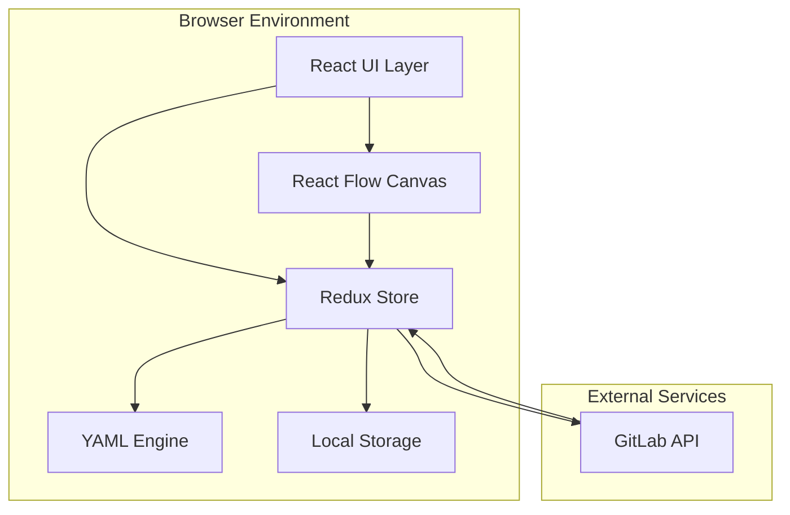
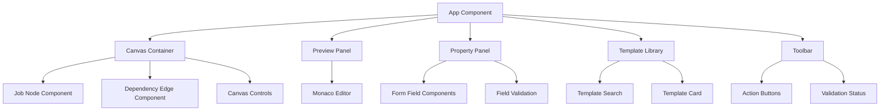
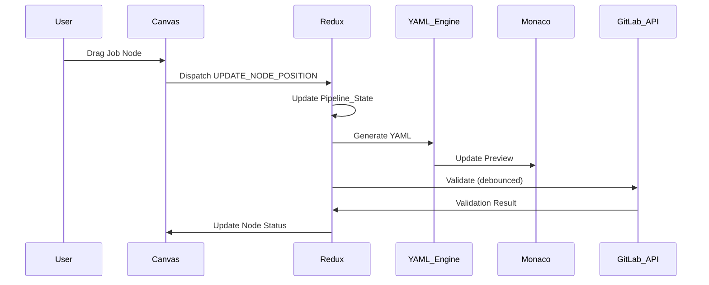

# Design Document: GitLab CI/CD Pipeline Visual Editor

## Overview

The GitLab CI/CD Pipeline Visual Editor is a web-based application that provides a visual, node-based interface for composing GitLab CI/CD pipelines. The system enables users to create, edit, and validate pipelines through drag-and-drop interactions while maintaining bidirectional synchronization with YAML format.

### Core Design Principles

1. **Visual-First Authoring**: The canvas is the primary interface for pipeline composition, with YAML as a synchronized output format
2. **Real-Time Feedback**: All changes propagate immediately through the system, providing instant validation and preview
3. **Bidirectional Fidelity**: YAML import and export preserve semantic meaning while optimizing for readability
4. **Progressive Disclosure**: Complex configuration options are accessible through contextual panels without cluttering the main interface
5. **Offline-First**: Core editing functionality works without GitLab API access, with validation as an enhancement

### System Context

The application operates as a standalone web client that integrates with GitLab's API for validation and template fetching. It does not require backend infrastructure for core functionality, relying on browser-based storage and computation.

## Architecture

### High-Level Architecture



### Technology Stack

**Frontend Framework**: React 18+ with TypeScript
- Provides component-based architecture with strong typing
- Large ecosystem for UI components and tooling
- Excellent developer experience with hot reload

**Canvas Library**: React Flow
- Purpose-built for node-based editors with DAG support
- Built-in zoom, pan, and connection validation
- Extensible node and edge rendering

**State Management**: Redux Toolkit
- Centralized state management with immutable updates
- Built-in undo/redo support via redux-undo
- DevTools integration for debugging state changes

**YAML Processing**: js-yaml
- Mature library for YAML parsing and serialization
- Supports YAML 1.2 specification
- Handles anchors and aliases for optimization

**Code Editor**: Monaco Editor
- Same editor as VS Code with full language support
- Built-in YAML syntax highlighting and validation
- Read-only mode for preview pane

**Styling**: Tailwind CSS
- Utility-first approach for rapid UI development
- Built-in dark mode support
- Consistent design system

**HTTP Client**: Axios
- Promise-based HTTP client for GitLab API integration
- Request/response interceptors for error handling
- Automatic request cancellation for debouncing

### Component Architecture



### Data Flow Architecture



## Components and Interfaces

### Pipeline_State Schema

The Pipeline_State is the central data structure representing the entire pipeline configuration. It serves as the single source of truth for both visual representation and YAML generation.

```typescript
interface Pipeline_State {
  version: string; // Schema version for migration support
  metadata: {
    created: string; // ISO timestamp
    modified: string; // ISO timestamp
    name?: string; // Optional pipeline name
  };
  global: {
    image?: string;
    variables?: Record<string, string | Variable>;
    cache?: CacheConfig;
    before_script?: string[];
    after_script?: string[];
  };
  stages: string[]; // Ordered list of stage names
  jobs: Record<string, Job_Node_Config>;
  // UI-specific metadata (not exported to YAML)
  ui: {
    nodes: Record<string, NodePosition>;
    viewport: { x: number; y: number; zoom: number };
  };
}

interface Job_Node_Config {
  id: string; // Unique identifier
  name: string; // Job name (key in .gitlab-ci.yml)
  stage: string;
  script: string[];
  image?: string;
  variables?: Record<string, string | Variable>;
  cache?: CacheConfig;
  artifacts?: ArtifactsConfig;
  dependencies?: string[]; // Job names this job depends on (artifacts)
  needs?: string[]; // Job names for DAG execution
  rules?: Rule[];
  before_script?: string[];
  after_script?: string[];
  trigger?: TriggerConfig;
  tags?: string[];
  allow_failure?: boolean;
  when?: 'on_success' | 'on_failure' | 'always' | 'manual' | 'delayed';
  timeout?: string;
  retry?: number | RetryConfig;
}

interface Variable {
  value: string;
  protected?: boolean;
  masked?: boolean;
}

interface CacheConfig {
  key?: string | { files?: string[]; prefix?: string };
  paths: string[];
  policy?: 'pull' | 'push' | 'pull-push';
  untracked?: boolean;
}

interface ArtifactsConfig {
  paths: string[];
  exclude?: string[];
  expire_in?: string;
  expose_as?: string;
  name?: string;
  when?: 'on_success' | 'on_failure' | 'always';
  reports?: Record<string, string | string[]>;
}

interface Rule {
  if?: string; // Condition expression
  when?: 'on_success' | 'on_failure' | 'always' | 'manual' | 'delayed' | 'never';
  allow_failure?: boolean;
  variables?: Record<string, string>;
}

interface TriggerConfig {
  project: string;
  branch?: string;
  strategy?: 'depend';
}

interface RetryConfig {
  max: number;
  when?: string | string[];
}

interface NodePosition {
  x: number;
  y: number;
}
```

### YAML_Engine Interface

The YAML_Engine provides bidirectional conversion between Pipeline_State and GitLab CI/CD YAML format.

```typescript
interface YAML_Engine {
  /**
   * Convert Pipeline_State to YAML string
   * Removes UI metadata and optimizes with anchors/aliases
   */
  toYAML(state: Pipeline_State): string;
  
  /**
   * Parse YAML string into Pipeline_State
   * Generates UI metadata for visual layout
   */
  fromYAML(yaml: string): Pipeline_State;
  
  /**
   * Validate YAML structure without full parsing
   * Returns syntax errors if any
   */
  validateSyntax(yaml: string): ValidationResult;
  
  /**
   * Detect repeated configuration blocks for anchor generation
   */
  detectAnchors(state: Pipeline_State): AnchorMap;
  
  /**
   * Apply auto-layout algorithm to generate node positions
   */
  generateLayout(jobs: Record<string, Job_Node_Config>, stages: string[]): Record<string, NodePosition>;
}

interface ValidationResult {
  valid: boolean;
  errors: Array<{
    line?: number;
    column?: number;
    message: string;
  }>;
}

interface AnchorMap {
  [anchorName: string]: {
    config: any;
    usedBy: string[]; // Job IDs that reference this anchor
  };
}
```

### Canvas Component Interface

```typescript
interface CanvasProps {
  pipelineState: Pipeline_State;
  onNodePositionChange: (nodeId: string, position: NodePosition) => void;
  onNodeClick: (nodeId: string) => void;
  onEdgeCreate: (sourceId: string, targetId: string) => void;
  onEdgeDelete: (sourceId: string, targetId: string) => void;
  onNodeDelete: (nodeId: string) => void;
  validationErrors: Record<string, string[]>; // nodeId -> error messages
}

interface JobNodeProps {
  id: string;
  data: Job_Node_Config;
  selected: boolean;
  hasErrors: boolean;
  errorMessages: string[];
}
```

### Property Panel Interface

```typescript
interface PropertyPanelProps {
  jobId: string | null; // null when no job selected
  jobConfig: Job_Node_Config | null;
  availableStages: string[];
  onUpdate: (jobId: string, updates: Partial<Job_Node_Config>) => void;
  onClose: () => void;
}

interface FormFieldProps<T> {
  label: string;
  value: T;
  onChange: (value: T) => void;
  validation?: (value: T) => string | null; // Returns error message or null
  helpText?: string;
  required?: boolean;
}
```

### GitLab API Integration Interface

```typescript
interface GitLabAPIClient {
  /**
   * Validate YAML using GitLab CI Lint API
   * POST /projects/:id/ci/lint
   */
  validateYAML(yaml: string, projectId?: string): Promise<LintResult>;
  
  /**
   * Fetch official GitLab CI templates
   * GET /templates/gitlab_ci_ymls
   */
  fetchTemplates(): Promise<Template[]>;
  
  /**
   * Fetch specific template content
   * GET /templates/gitlab_ci_ymls/:key
   */
  fetchTemplate(key: string): Promise<string>;
}

interface LintResult {
  valid: boolean;
  errors: string[];
  warnings?: string[];
  merged_yaml?: string; // Expanded YAML with includes resolved
}

interface Template {
  key: string;
  name: string;
  description?: string;
  content?: string; // May be lazy-loaded
}
```

### Redux Store Structure

```typescript
interface RootState {
  pipeline: {
    present: Pipeline_State;
    past: Pipeline_State[];
    future: Pipeline_State[];
  };
  ui: {
    selectedNodeId: string | null;
    propertyPanelOpen: boolean;
    templateLibraryOpen: boolean;
    validationStatus: 'idle' | 'validating' | 'valid' | 'invalid' | 'offline';
    validationErrors: Record<string, string[]>;
    theme: 'dark' | 'light';
    showWelcome: boolean;
    showTutorial: boolean;
  };
  templates: {
    official: Template[];
    custom: Template[];
    loading: boolean;
    error: string | null;
  };
  persistence: {
    lastSaved: string | null; // ISO timestamp
    autoSaveEnabled: boolean;
  };
}
```

## Data Models

### Job Node Visual Representation

Each Job_Node on the canvas is rendered as a React Flow node with the following visual structure:

```
┌─────────────────────────┐
│ 🔧 build                │  <- Job name with icon
├─────────────────────────┤
│ Stage: build            │  <- Stage label
│ Image: node:16          │  <- Key properties
│ ⚠️ 2 validation errors  │  <- Error indicator (if any)
└─────────────────────────┘
```

Node styling varies based on state:
- **Default**: Dark background with blue border
- **Selected**: Highlighted border with glow effect
- **Error**: Red border with error icon
- **Trigger Job**: Purple accent to distinguish from regular jobs

### Dependency Edge Representation

Edges represent the "needs" relationship between jobs. They are rendered as directed arrows with the following properties:

- **Style**: Bezier curves for visual clarity
- **Color**: Gray for normal dependencies, red for invalid/circular
- **Arrow**: Solid arrowhead pointing to dependent job
- **Label**: Optional label showing dependency type (artifacts, needs)

### Stage Swim Lanes

Stages are visualized as horizontal swim lanes on the canvas:

```
┌─────────────────────────────────────────┐
│ build                                   │
│  [job1]  [job2]                        │
├─────────────────────────────────────────┤
│ test                                    │
│  [job3]  [job4]  [job5]                │
├─────────────────────────────────────────┤
│ deploy                                  │
│  [job6]                                 │
└─────────────────────────────────────────┘
```

Auto-layout algorithm positions jobs within their stage swim lane, with explicit "needs" dependencies shown as edges crossing swim lanes.

## YAML_Engine Design

### Bidirectional Conversion Strategy

The YAML_Engine implements a two-phase conversion process:

**Pipeline_State → YAML**:
1. **Normalization**: Remove UI-specific metadata from Pipeline_State
2. **Anchor Detection**: Identify repeated configuration blocks (cache, variables, etc.)
3. **Anchor Generation**: Create YAML anchors (&anchor_name) for repeated blocks
4. **Alias Substitution**: Replace repeated blocks with aliases (*anchor_name)
5. **Ordering**: Sort jobs by stage, then alphabetically within stage
6. **Serialization**: Convert to YAML string using js-yaml with custom formatting

**YAML → Pipeline_State**:
1. **Parsing**: Parse YAML string using js-yaml (resolves anchors/aliases automatically)
2. **Validation**: Verify required fields and structure
3. **Job Extraction**: Extract job definitions and global configuration
4. **Dependency Analysis**: Build dependency graph from "needs" and stage ordering
5. **Layout Generation**: Apply auto-layout algorithm to generate node positions
6. **Metadata Creation**: Add UI-specific metadata (node positions, viewport)

### Anchor Detection Algorithm

The anchor detection algorithm identifies configuration blocks that appear in multiple jobs:

```typescript
function detectAnchors(state: Pipeline_State): AnchorMap {
  const configBlocks = new Map<string, { config: any; jobs: string[] }>();
  
  // Collect cache configurations
  for (const [jobId, job] of Object.entries(state.jobs)) {
    if (job.cache) {
      const key = JSON.stringify(job.cache);
      if (!configBlocks.has(key)) {
        configBlocks.set(key, { config: job.cache, jobs: [] });
      }
      configBlocks.get(key)!.jobs.push(jobId);
    }
  }
  
  // Generate anchors for blocks used by 2+ jobs
  const anchors: AnchorMap = {};
  let anchorIndex = 0;
  
  for (const [key, { config, jobs }] of configBlocks.entries()) {
    if (jobs.length >= 2) {
      const anchorName = `cache_${anchorIndex++}`;
      anchors[anchorName] = { config, usedBy: jobs };
    }
  }
  
  return anchors;
}
```

### Auto-Layout Algorithm

The auto-layout algorithm positions jobs on the canvas based on stage and dependencies:

```typescript
function generateLayout(
  jobs: Record<string, Job_Node_Config>,
  stages: string[]
): Record<string, NodePosition> {
  const positions: Record<string, NodePosition> = {};
  const stageHeight = 200; // Vertical spacing between stages
  const jobWidth = 250; // Horizontal spacing between jobs
  const jobsPerStage = new Map<string, string[]>();
  
  // Group jobs by stage
  for (const [jobId, job] of Object.entries(jobs)) {
    if (!jobsPerStage.has(job.stage)) {
      jobsPerStage.set(job.stage, []);
    }
    jobsPerStage.get(job.stage)!.push(jobId);
  }
  
  // Position jobs within each stage
  stages.forEach((stage, stageIndex) => {
    const jobsInStage = jobsPerStage.get(stage) || [];
    const stageY = stageIndex * stageHeight;
    
    jobsInStage.forEach((jobId, jobIndex) => {
      positions[jobId] = {
        x: jobIndex * jobWidth,
        y: stageY
      };
    });
  });
  
  return positions;
}
```

### YAML Optimization Examples

**Before Optimization** (repetitive):
```yaml
job1:
  cache:
    key: $CI_COMMIT_REF_SLUG
    paths:
      - node_modules/
  script:
    - npm test

job2:
  cache:
    key: $CI_COMMIT_REF_SLUG
    paths:
      - node_modules/
  script:
    - npm build
```

**After Optimization** (with anchors):
```yaml
.cache_template: &cache_config
  key: $CI_COMMIT_REF_SLUG
  paths:
    - node_modules/

job1:
  cache: *cache_config
  script:
    - npm test

job2:
  cache: *cache_config
  script:
    - npm build
```

## State Management with Redux Toolkit

### Action Creators

```typescript
// Job actions
const addJob = createAction<{ job: Job_Node_Config; position: NodePosition }>('pipeline/addJob');
const updateJob = createAction<{ jobId: string; updates: Partial<Job_Node_Config> }>('pipeline/updateJob');
const deleteJob = createAction<string>('pipeline/deleteJob');
const moveJob = createAction<{ jobId: string; position: NodePosition }>('pipeline/moveJob');

// Dependency actions
const addDependency = createAction<{ sourceId: string; targetId: string }>('pipeline/addDependency');
const removeDependency = createAction<{ sourceId: string; targetId: string }>('pipeline/removeDependency');

// Pipeline actions
const importYAML = createAction<string>('pipeline/importYAML');
const exportYAML = createAction('pipeline/exportYAML');
const clearPipeline = createAction('pipeline/clearPipeline');

// UI actions
const selectNode = createAction<string | null>('ui/selectNode');
const setValidationStatus = createAction<RootState['ui']['validationStatus']>('ui/setValidationStatus');
const setValidationErrors = createAction<Record<string, string[]>>('ui/setValidationErrors');
```

### Middleware for Side Effects

```typescript
// Auto-save middleware
const autoSaveMiddleware: Middleware = (store) => (next) => (action) => {
  const result = next(action);
  
  // Save to local storage after pipeline state changes
  if (action.type.startsWith('pipeline/')) {
    const state = store.getState();
    localStorage.setItem('pipeline_state', JSON.stringify(state.pipeline.present));
    localStorage.setItem('last_saved', new Date().toISOString());
  }
  
  return result;
};

// Validation middleware (debounced)
const validationMiddleware: Middleware = (store) => {
  let timeoutId: NodeJS.Timeout | null = null;
  
  return (next) => (action) => {
    const result = next(action);
    
    // Trigger validation after pipeline changes
    if (action.type.startsWith('pipeline/')) {
      if (timeoutId) clearTimeout(timeoutId);
      
      timeoutId = setTimeout(async () => {
        const state = store.getState();
        const yaml = yamlEngine.toYAML(state.pipeline.present);
        
        try {
          store.dispatch(setValidationStatus('validating'));
          const result = await gitlabAPI.validateYAML(yaml);
          
          if (result.valid) {
            store.dispatch(setValidationStatus('valid'));
            store.dispatch(setValidationErrors({}));
          } else {
            store.dispatch(setValidationStatus('invalid'));
            // Map errors to job IDs (requires parsing error messages)
            store.dispatch(setValidationErrors(parseValidationErrors(result.errors)));
          }
        } catch (error) {
          store.dispatch(setValidationStatus('offline'));
        }
      }, 500); // 500ms debounce
    }
    
    return result;
  };
};
```

### Undo/Redo Implementation

Redux Toolkit integrates with redux-undo to provide undo/redo functionality:

```typescript
import undoable from 'redux-undo';

const pipelineReducer = createReducer(initialState, (builder) => {
  builder
    .addCase(addJob, (state, action) => {
      state.jobs[action.payload.job.id] = action.payload.job;
      state.ui.nodes[action.payload.job.id] = action.payload.position;
    })
    .addCase(updateJob, (state, action) => {
      Object.assign(state.jobs[action.payload.jobId], action.payload.updates);
    })
    // ... other cases
});

// Wrap with undoable to enable undo/redo
const undoablePipelineReducer = undoable(pipelineReducer, {
  limit: 50, // Keep last 50 states
  filter: excludeAction(['ui/selectNode']), // Don't track UI-only actions
});
```

## Monaco Editor Integration

### Configuration

```typescript
import * as monaco from 'monaco-editor';

// Configure YAML language support
monaco.languages.register({ id: 'yaml' });

// Configure dark theme
monaco.editor.defineTheme('gitlab-dark', {
  base: 'vs-dark',
  inherit: true,
  rules: [
    { token: 'comment', foreground: '6A737D' },
    { token: 'string', foreground: '9ECBFF' },
    { token: 'number', foreground: '79B8FF' },
    { token: 'keyword', foreground: 'F97583' },
  ],
  colors: {
    'editor.background': '#1F2937', // Tailwind gray-800
    'editor.foreground': '#F3F4F6', // Tailwind gray-100
  },
});

// Create read-only editor instance
const editor = monaco.editor.create(containerElement, {
  value: '',
  language: 'yaml',
  theme: 'gitlab-dark',
  readOnly: true,
  minimap: { enabled: false },
  scrollBeyondLastLine: false,
  lineNumbers: 'on',
  folding: true,
});
```

### Real-Time Update Strategy

The Monaco editor subscribes to Redux store changes and updates when the YAML output changes:

```typescript
function MonacoPreview() {
  const editorRef = useRef<monaco.editor.IStandaloneCodeEditor | null>(null);
  const pipelineState = useSelector((state: RootState) => state.pipeline.present);
  
  // Memoize YAML generation to avoid unnecessary recalculation
  const yaml = useMemo(() => {
    return yamlEngine.toYAML(pipelineState);
  }, [pipelineState]);
  
  useEffect(() => {
    if (editorRef.current) {
      const currentValue = editorRef.current.getValue();
      if (currentValue !== yaml) {
        editorRef.current.setValue(yaml);
      }
    }
  }, [yaml]);
  
  return <div ref={(el) => {
    if (el && !editorRef.current) {
      editorRef.current = monaco.editor.create(el, { /* config */ });
    }
  }} />;
}
```

## GitLab API Integration Strategy

### API Client Implementation

```typescript
class GitLabAPIClient {
  private baseURL: string;
  private token: string | null;
  private axios: AxiosInstance;
  
  constructor(baseURL = 'https://gitlab.com/api/v4') {
    this.baseURL = baseURL;
    this.token = localStorage.getItem('gitlab_token');
    
    this.axios = axios.create({
      baseURL: this.baseURL,
      headers: this.token ? { 'Authorization': `Bearer ${this.token}` } : {},
    });
  }
  
  async validateYAML(yaml: string, projectId?: string): Promise<LintResult> {
    try {
      const endpoint = projectId 
        ? `/projects/${encodeURIComponent(projectId)}/ci/lint`
        : '/ci/lint';
      
      const response = await this.axios.post(endpoint, {
        content: yaml,
        dry_run: true,
      });
      
      return {
        valid: response.data.valid,
        errors: response.data.errors || [],
        warnings: response.data.warnings || [],
        merged_yaml: response.data.merged_yaml,
      };
    } catch (error) {
      throw new Error('GitLab API validation failed');
    }
  }
  
  async fetchTemplates(): Promise<Template[]> {
    try {
      const response = await this.axios.get('/templates/gitlab_ci_ymls');
      return response.data.map((t: any) => ({
        key: t.key,
        name: t.name,
        description: t.description,
      }));
    } catch (error) {
      throw new Error('Failed to fetch templates');
    }
  }
  
  async fetchTemplate(key: string): Promise<string> {
    try {
      const response = await this.axios.get(`/templates/gitlab_ci_ymls/${key}`);
      return response.data.content;
    } catch (error) {
      throw new Error(`Failed to fetch template: ${key}`);
    }
  }
}
```

### Offline Handling

The application gracefully degrades when the GitLab API is unavailable:

1. **Validation**: Display "Offline - validation unavailable" status, allow continued editing
2. **Templates**: Use cached templates from previous session, disable fetching new templates
3. **Export**: YAML export continues to work using local YAML_Engine

```typescript
async function validateWithFallback(yaml: string): Promise<void> {
  try {
    dispatch(setValidationStatus('validating'));
    const result = await gitlabAPI.validateYAML(yaml);
    
    if (result.valid) {
      dispatch(setValidationStatus('valid'));
    } else {
      dispatch(setValidationStatus('invalid'));
      dispatch(setValidationErrors(parseErrors(result.errors)));
    }
  } catch (error) {
    // Fallback to offline mode
    dispatch(setValidationStatus('offline'));
    console.warn('GitLab API unavailable, continuing in offline mode');
  }
}
```

## Template Library System Design

### Template Storage

Templates are stored in two categories:

1. **Official Templates**: Fetched from GitLab API and cached in Redux store
2. **Custom Templates**: User-created templates stored in local storage

```typescript
interface TemplateStore {
  official: Template[];
  custom: Template[];
  lastFetched: string | null; // ISO timestamp
}

// Load custom templates from local storage
function loadCustomTemplates(): Template[] {
  const stored = localStorage.getItem('custom_templates');
  return stored ? JSON.parse(stored) : [];
}

// Save custom template
function saveCustomTemplate(template: Template): void {
  const custom = loadCustomTemplates();
  custom.push(template);
  localStorage.setItem('custom_templates', JSON.stringify(custom));
}
```

### Template Search and Filtering

```typescript
interface TemplateFilter {
  query: string;
  category?: 'build' | 'test' | 'deploy' | 'security' | 'all';
  source?: 'official' | 'custom' | 'all';
}

function filterTemplates(templates: Template[], filter: TemplateFilter): Template[] {
  return templates.filter(template => {
    // Text search in name and description
    const matchesQuery = !filter.query || 
      template.name.toLowerCase().includes(filter.query.toLowerCase()) ||
      template.description?.toLowerCase().includes(filter.query.toLowerCase());
    
    // Category filter (based on template metadata or name patterns)
    const matchesCategory = !filter.category || filter.category === 'all' ||
      template.name.toLowerCase().includes(filter.category);
    
    return matchesQuery && matchesCategory;
  });
}
```

### Template Application

When a user drags a template onto the canvas:

1. Parse template YAML to extract job configuration
2. Generate unique job ID and name (append number if name conflicts)
3. Create Job_Node_Config from template
4. Add to Pipeline_State at drop position
5. Open Property_Panel for customization

```typescript
function applyTemplate(template: Template, position: NodePosition): void {
  // Parse template YAML
  const templateState = yamlEngine.fromYAML(template.content);
  
  // Extract first job from template (templates may contain multiple jobs)
  const [jobName, jobConfig] = Object.entries(templateState.jobs)[0];
  
  // Generate unique ID and name
  const uniqueId = generateUniqueId();
  const uniqueName = generateUniqueName(jobName, pipelineState.jobs);
  
  // Create job node
  const newJob: Job_Node_Config = {
    ...jobConfig,
    id: uniqueId,
    name: uniqueName,
  };
  
  // Add to pipeline
  dispatch(addJob({ job: newJob, position }));
  dispatch(selectNode(uniqueId));
}
```

## Dark Mode UI Implementation

### Tailwind CSS Configuration

```typescript
// tailwind.config.js
module.exports = {
  darkMode: 'class', // Enable class-based dark mode
  theme: {
    extend: {
      colors: {
        // Custom color palette for GitLab theme
        gitlab: {
          dark: {
            bg: '#1F2937',      // Main background
            surface: '#374151',  // Card/panel background
            border: '#4B5563',   // Borders
            text: '#F3F4F6',     // Primary text
            'text-muted': '#9CA3AF', // Secondary text
          },
          accent: {
            blue: '#3B82F6',
            purple: '#8B5CF6',
            green: '#10B981',
            red: '#EF4444',
            yellow: '#F59E0B',
          },
        },
      },
    },
  },
};
```

### Component Styling

All components use Tailwind classes with dark mode variants:

```tsx
function JobNode({ data, selected, hasErrors }: JobNodeProps) {
  return (
    <div className={`
      bg-gitlab-dark-surface 
      border-2 
      ${selected ? 'border-gitlab-accent-blue' : 'border-gitlab-dark-border'}
      ${hasErrors ? 'border-gitlab-accent-red' : ''}
      rounded-lg 
      p-4 
      shadow-lg
      text-gitlab-dark-text
    `}>
      <div className="font-semibold text-lg">{data.name}</div>
      <div className="text-sm text-gitlab-dark-text-muted">
        Stage: {data.stage}
      </div>
      {hasErrors && (
        <div className="text-gitlab-accent-red text-sm mt-2">
          ⚠️ Validation errors
        </div>
      )}
    </div>
  );
}
```

### Theme Toggle

```typescript
function ThemeToggle() {
  const theme = useSelector((state: RootState) => state.ui.theme);
  const dispatch = useDispatch();
  
  const toggleTheme = () => {
    const newTheme = theme === 'dark' ? 'light' : 'dark';
    dispatch(setTheme(newTheme));
    document.documentElement.classList.toggle('dark', newTheme === 'dark');
    localStorage.setItem('theme', newTheme);
  };
  
  return (
    <button onClick={toggleTheme} className="p-2 rounded hover:bg-gitlab-dark-surface">
      {theme === 'dark' ? '☀️' : '🌙'}
    </button>
  );
}
```

### Accessibility Considerations

All color combinations meet WCAG AA contrast requirements:

- **Background to Text**: #1F2937 to #F3F4F6 (contrast ratio 12.6:1)
- **Surface to Text**: #374151 to #F3F4F6 (contrast ratio 9.2:1)
- **Accent Colors**: All accent colors tested against dark backgrounds for minimum 4.5:1 ratio


## Correctness Properties

*A property is a characteristic or behavior that should hold true across all valid executions of a system—essentially, a formal statement about what the system should do. Properties serve as the bridge between human-readable specifications and machine-verifiable correctness guarantees.*

The GitLab CI/CD Pipeline Visual Editor has several core subsystems that are amenable to property-based testing, particularly the YAML_Engine, dependency graph management, and state persistence. The following properties define the correctness criteria for these subsystems.

### Property 1: DAG Acyclicity Invariant

*For any* sequence of edge additions to the dependency graph, if adding an edge would create a cycle, the system SHALL reject the addition and maintain the acyclic property of the graph.

**Validates: Requirements 1.5, 8.1**

### Property 2: Job Configuration Validation

*For any* job configuration that is missing required fields (name, stage, or script), the system SHALL prevent job creation and display appropriate validation errors.

**Validates: Requirements 2.4**

### Property 3: YAML Generation Validity

*For any* valid Pipeline_State, the YAML_Engine SHALL generate syntactically valid GitLab CI/CD YAML that passes GitLab's schema validation, with all job properties (scripts, artifacts, cache, rules, triggers) correctly formatted according to GitLab CI/CD specification.

**Validates: Requirements 4.1, 4.2, 8.5, 11.7, 12.5, 13.4**

### Property 4: YAML Anchor/Alias Optimization

*For any* Pipeline_State containing configuration blocks (cache, variables, before_script, after_script) that are identical across two or more jobs, the YAML_Engine SHALL generate YAML anchors for those blocks and use aliases to reference them, reducing duplication.

**Validates: Requirements 4.3, 4.4**

### Property 5: Job Ordering by Stage

*For any* Pipeline_State, the generated YAML SHALL order jobs such that all jobs in an earlier stage appear before all jobs in a later stage, following the stage order defined in the stages array.

**Validates: Requirements 4.5**

### Property 6: YAML Round-Trip Semantic Preservation

*For any* valid Pipeline_State, converting to YAML and parsing back SHALL produce a Pipeline_State that is semantically equivalent (same jobs, stages, dependencies, and configuration), though UI-specific metadata may differ.

**Validates: Requirements 4.6, 4.7, 7.2**

### Property 7: Comment Preservation in Round-Trip

*For any* valid GitLab CI/CD YAML containing comments, parsing to Pipeline_State and converting back to YAML SHALL preserve comments where they are associated with job definitions or global configuration (note: comments within complex nested structures may not be preserved due to YAML parser limitations).

**Validates: Requirements 7.5**

### Property 8: JSON Persistence Round-Trip

*For any* Pipeline_State, serializing to JSON and deserializing back SHALL produce an exactly equivalent Pipeline_State, including all UI metadata (node positions, viewport state).

**Validates: Requirements 7.7, 10.2**

### Property 9: Dependency Referential Integrity

*For any* Pipeline_State, all job dependencies (both "needs" and "dependencies" arrays) SHALL reference only job IDs that exist in the Pipeline_State.jobs map.

**Validates: Requirements 8.2**

### Property 10: Cascade Deletion of Edges

*For any* Pipeline_State and any job deletion operation, all dependency edges (in both "needs" and "dependencies" arrays of other jobs) that reference the deleted job SHALL be automatically removed.

**Validates: Requirements 8.3**

### Property 11: Undo/Redo State Correctness

*For any* sequence of state-modifying operations (add job, delete job, update job, add edge, delete edge), applying undo SHALL restore the previous state, and applying redo SHALL restore the state before undo, maintaining a consistent history stack.

**Validates: Requirements 10.4**

### Property 12: Artifact Path Pattern Validation

*For any* artifact path string, the validation function SHALL correctly identify whether it is a valid file glob pattern according to GitLab's artifact path specification (supporting wildcards *, **, and character classes).

**Validates: Requirements 12.4**

### Property 13: Template Persistence Round-Trip

*For any* custom template saved by the user, retrieving the template from storage SHALL return a template with identical configuration (job properties, scripts, variables) to the original.

**Validates: Requirements 6.5**

### Property 14: Edge Creation State Update

*For any* two valid Job_Nodes in the Pipeline_State, creating a Dependency_Edge between them SHALL add the target job ID to the source job's "needs" array in the Pipeline_State.

**Validates: Requirements 1.4**

## Error Handling

The application implements comprehensive error handling across all subsystems to ensure graceful degradation and clear user feedback.

### YAML Parsing Errors

**Scenario**: User imports invalid YAML file

**Handling Strategy**:
1. Catch parsing exceptions from js-yaml library
2. Extract line/column information from error object
3. Display error message in modal dialog with specific location
4. Highlight problematic line in a preview pane
5. Provide suggestions for common syntax errors (missing colons, incorrect indentation)
6. Allow user to edit YAML in-place or cancel import

**Error Message Format**:
```
YAML Parsing Error (Line 15, Column 3)
Invalid indentation: expected 2 spaces, found 3

Suggestion: Check that all indentation uses consistent spacing (2 or 4 spaces)
```

### GitLab API Errors

**Scenario**: GitLab API is unreachable or returns errors

**Handling Strategy**:
1. **Network Timeout**: Display "Offline Mode" indicator, disable validation, allow continued editing
2. **Authentication Error**: Prompt user to provide GitLab personal access token
3. **Rate Limiting**: Display warning about rate limits, increase debounce delay
4. **Validation Errors**: Parse error messages from API response, map to specific jobs, display inline on canvas

**Offline Mode Behavior**:
- Validation status shows "Offline - validation unavailable"
- Template fetching disabled, use cached templates
- Export functionality continues to work
- Display banner: "Working offline. Connect to GitLab for validation and templates."

### Circular Dependency Detection

**Scenario**: User attempts to create edge that would form a cycle

**Handling Strategy**:
1. Run cycle detection algorithm before adding edge
2. If cycle detected, prevent edge creation
3. Highlight the cycle path on canvas with red edges
4. Display modal: "Cannot create dependency: would create circular dependency"
5. Show the cycle path: Job A → Job B → Job C → Job A

**Algorithm**: Use depth-first search (DFS) to detect cycles in O(V + E) time

```typescript
function detectCycle(graph: DependencyGraph, newEdge: Edge): boolean {
  const visited = new Set<string>();
  const recursionStack = new Set<string>();
  
  function dfs(nodeId: string): boolean {
    visited.add(nodeId);
    recursionStack.add(nodeId);
    
    const neighbors = graph.getNeighbors(nodeId);
    for (const neighbor of neighbors) {
      if (!visited.has(neighbor)) {
        if (dfs(neighbor)) return true;
      } else if (recursionStack.has(neighbor)) {
        return true; // Cycle detected
      }
    }
    
    recursionStack.delete(nodeId);
    return false;
  }
  
  // Temporarily add new edge and check for cycles
  graph.addEdge(newEdge);
  const hasCycle = dfs(newEdge.source);
  graph.removeEdge(newEdge);
  
  return hasCycle;
}
```

### State Persistence Errors

**Scenario**: Local storage quota exceeded or corrupted data

**Handling Strategy**:
1. **Quota Exceeded**: Display warning, offer to export as file instead
2. **Corrupted Data**: Catch JSON parse errors, prompt user to start fresh or restore from backup
3. **Version Mismatch**: Detect schema version, run migration if possible, otherwise prompt for manual import

**Recovery Options**:
- "Start with empty pipeline"
- "Import from .gitlab-ci.yml file"
- "Restore from exported JSON backup"

### Form Validation Errors

**Scenario**: User enters invalid data in Property Panel

**Handling Strategy**:
1. Validate on blur for each field
2. Display inline error message below field
3. Disable "Save" button until all errors resolved
4. Provide specific guidance for each error type

**Validation Rules**:
- **Job Name**: Required, alphanumeric with underscores/hyphens, unique within pipeline
- **Stage**: Required, must be in stages list
- **Script**: Required, at least one non-empty line
- **Image**: Optional, valid Docker image format (name:tag)
- **Artifact Paths**: Valid glob patterns
- **Cache Key**: Valid GitLab CI variable syntax
- **Rules**: Valid GitLab CI rule syntax

### Canvas Interaction Errors

**Scenario**: User performs invalid canvas operation

**Handling Strategy**:
1. **Delete Last Job**: Prevent deletion if only one job remains, show warning
2. **Invalid Connection**: Prevent connection between incompatible node types (e.g., trigger to regular job)
3. **Node Overlap**: Auto-adjust positions to prevent complete overlap
4. **Out of Bounds**: Constrain dragging to canvas bounds or auto-expand canvas

### Template Application Errors

**Scenario**: Template cannot be applied to current pipeline

**Handling Strategy**:
1. **Missing Dependencies**: Warn if template requires stages not in current pipeline, offer to add stages
2. **Name Conflict**: Auto-rename job with numeric suffix (e.g., "build" → "build_2")
3. **Invalid Template**: Catch parsing errors, display error message, prevent application

## Testing Strategy

The testing strategy employs a multi-layered approach combining property-based testing, example-based unit tests, integration tests, and end-to-end tests.

### Property-Based Testing

**Library**: fast-check (JavaScript/TypeScript property-based testing library)

**Configuration**:
- Minimum 100 iterations per property test
- Seed-based reproducibility for failed tests
- Shrinking enabled to find minimal failing examples

**Test Organization**:
Each property test references its design document property using a comment tag:

```typescript
/**
 * Feature: gitlab-cicd-visual-editor
 * Property 6: YAML Round-Trip Semantic Preservation
 */
test('YAML round-trip preserves semantics', () => {
  fc.assert(
    fc.property(pipelineStateArbitrary(), (state) => {
      const yaml = yamlEngine.toYAML(state);
      const parsed = yamlEngine.fromYAML(yaml);
      expect(semanticallyEquivalent(state, parsed)).toBe(true);
    }),
    { numRuns: 100 }
  );
});
```

**Generators (Arbitraries)**:

```typescript
// Generate random Pipeline_State
function pipelineStateArbitrary(): fc.Arbitrary<Pipeline_State> {
  return fc.record({
    version: fc.constant('1.0'),
    metadata: fc.record({
      created: fc.date().map(d => d.toISOString()),
      modified: fc.date().map(d => d.toISOString()),
      name: fc.option(fc.string(), { nil: undefined }),
    }),
    global: fc.record({
      image: fc.option(dockerImageArbitrary(), { nil: undefined }),
      variables: fc.option(fc.dictionary(fc.string(), fc.string()), { nil: undefined }),
    }),
    stages: fc.array(fc.string(), { minLength: 1, maxLength: 5 }),
    jobs: fc.dictionary(
      fc.string(), // job ID
      jobNodeConfigArbitrary(),
      { minKeys: 1, maxKeys: 10 }
    ),
    ui: fc.record({
      nodes: fc.dictionary(fc.string(), nodePositionArbitrary()),
      viewport: fc.record({
        x: fc.integer(),
        y: fc.integer(),
        zoom: fc.float({ min: 0.1, max: 2.0 }),
      }),
    }),
  });
}

// Generate random Job_Node_Config
function jobNodeConfigArbitrary(): fc.Arbitrary<Job_Node_Config> {
  return fc.record({
    id: fc.uuid(),
    name: fc.string({ minLength: 1, maxLength: 20 }),
    stage: fc.constantFrom('build', 'test', 'deploy'),
    script: fc.array(fc.string(), { minLength: 1, maxLength: 5 }),
    image: fc.option(dockerImageArbitrary(), { nil: undefined }),
    variables: fc.option(fc.dictionary(fc.string(), fc.string()), { nil: undefined }),
    needs: fc.option(fc.array(fc.string()), { nil: undefined }),
    // ... other optional fields
  });
}

// Generate valid Docker image names
function dockerImageArbitrary(): fc.Arbitrary<string> {
  return fc.tuple(
    fc.stringOf(fc.constantFrom(...'abcdefghijklmnopqrstuvwxyz0123456789-'.split('')), { minLength: 1, maxLength: 20 }),
    fc.stringOf(fc.constantFrom(...'abcdefghijklmnopqrstuvwxyz0123456789.-'.split('')), { minLength: 1, maxLength: 10 })
  ).map(([name, tag]) => `${name}:${tag}`);
}
```

**Property Test Coverage**:

| Property | Test File | Generator Used |
|----------|-----------|----------------|
| 1. DAG Acyclicity | `dependency-graph.property.test.ts` | `dependencyGraphArbitrary()` |
| 2. Job Validation | `job-validation.property.test.ts` | `invalidJobConfigArbitrary()` |
| 3. YAML Validity | `yaml-engine.property.test.ts` | `pipelineStateArbitrary()` |
| 4. Anchor/Alias Optimization | `yaml-optimization.property.test.ts` | `pipelineStateWithDuplicatesArbitrary()` |
| 5. Job Ordering | `yaml-ordering.property.test.ts` | `pipelineStateArbitrary()` |
| 6. YAML Round-Trip | `yaml-engine.property.test.ts` | `pipelineStateArbitrary()` |
| 7. Comment Preservation | `yaml-comments.property.test.ts` | `yamlWithCommentsArbitrary()` |
| 8. JSON Persistence | `persistence.property.test.ts` | `pipelineStateArbitrary()` |
| 9. Referential Integrity | `dependency-graph.property.test.ts` | `pipelineStateArbitrary()` |
| 10. Cascade Deletion | `job-operations.property.test.ts` | `pipelineStateArbitrary()` |
| 11. Undo/Redo | `state-history.property.test.ts` | `operationSequenceArbitrary()` |
| 12. Artifact Path Validation | `validation.property.test.ts` | `fileGlobArbitrary()` |
| 13. Template Persistence | `templates.property.test.ts` | `templateArbitrary()` |
| 14. Edge Creation | `canvas-operations.property.test.ts` | `pipelineStateArbitrary()` |

### Unit Testing

**Library**: Jest with React Testing Library

**Focus Areas**:
- Component rendering with specific props
- User interactions (clicks, drags, form inputs)
- Redux action creators and reducers
- Utility functions and helpers
- Form validation logic

**Example Tests**:

```typescript
describe('JobNode Component', () => {
  it('renders job name and stage', () => {
    const job = { id: '1', name: 'build', stage: 'build', script: ['npm build'] };
    render(<JobNode data={job} selected={false} hasErrors={false} />);
    expect(screen.getByText('build')).toBeInTheDocument();
    expect(screen.getByText('Stage: build')).toBeInTheDocument();
  });
  
  it('displays error indicator when hasErrors is true', () => {
    const job = { id: '1', name: 'build', stage: 'build', script: ['npm build'] };
    render(<JobNode data={job} selected={false} hasErrors={true} errorMessages={['Invalid script']} />);
    expect(screen.getByText(/validation errors/i)).toBeInTheDocument();
  });
});

describe('pipelineReducer', () => {
  it('adds job to state', () => {
    const initialState = { jobs: {}, stages: ['build'], ui: { nodes: {} } };
    const job = { id: '1', name: 'test', stage: 'build', script: ['npm test'] };
    const action = addJob({ job, position: { x: 0, y: 0 } });
    const newState = pipelineReducer(initialState, action);
    expect(newState.jobs['1']).toEqual(job);
  });
});
```

### Integration Testing

**Library**: Jest with MSW (Mock Service Worker) for API mocking

**Focus Areas**:
- GitLab API integration (validation, template fetching)
- Local storage persistence
- Redux middleware (auto-save, validation)
- YAML_Engine with real GitLab YAML examples

**Example Tests**:

```typescript
describe('GitLab API Integration', () => {
  beforeEach(() => {
    server.use(
      rest.post('https://gitlab.com/api/v4/ci/lint', (req, res, ctx) => {
        return res(ctx.json({ valid: true, errors: [] }));
      })
    );
  });
  
  it('validates YAML through GitLab API', async () => {
    const yaml = 'test:\n  script:\n    - echo "test"';
    const result = await gitlabAPI.validateYAML(yaml);
    expect(result.valid).toBe(true);
  });
  
  it('handles API errors gracefully', async () => {
    server.use(
      rest.post('https://gitlab.com/api/v4/ci/lint', (req, res, ctx) => {
        return res(ctx.status(500));
      })
    );
    
    await expect(gitlabAPI.validateYAML('test')).rejects.toThrow();
  });
});
```

### End-to-End Testing

**Library**: Playwright

**Focus Areas**:
- Complete user workflows (create pipeline, add jobs, export YAML)
- Cross-browser compatibility (Chrome, Firefox, Safari)
- Keyboard shortcuts and accessibility
- Performance with large pipelines (50+ jobs)

**Example Tests**:

```typescript
test('create simple pipeline and export YAML', async ({ page }) => {
  await page.goto('http://localhost:3000');
  
  // Add first job
  await page.click('[data-testid="add-job-button"]');
  await page.fill('[data-testid="job-name-input"]', 'build');
  await page.fill('[data-testid="job-script-input"]', 'npm build');
  await page.click('[data-testid="save-job-button"]');
  
  // Add second job
  await page.click('[data-testid="add-job-button"]');
  await page.fill('[data-testid="job-name-input"]', 'test');
  await page.fill('[data-testid="job-script-input"]', 'npm test');
  await page.click('[data-testid="save-job-button"]');
  
  // Export YAML
  const downloadPromise = page.waitForEvent('download');
  await page.click('[data-testid="export-button"]');
  const download = await downloadPromise;
  
  // Verify YAML content
  const content = await download.path();
  const yaml = fs.readFileSync(content, 'utf-8');
  expect(yaml).toContain('build:');
  expect(yaml).toContain('test:');
});
```

### Test Coverage Goals

- **Unit Tests**: 80% code coverage for components and utilities
- **Property Tests**: 100% coverage of all 14 correctness properties
- **Integration Tests**: All external integrations (GitLab API, local storage)
- **E2E Tests**: All critical user workflows (create, edit, import, export)

### Continuous Integration

Tests run on every commit via GitHub Actions:

```yaml
name: CI
on: [push, pull_request]
jobs:
  test:
    runs-on: ubuntu-latest
    steps:
      - uses: actions/checkout@v3
      - uses: actions/setup-node@v3
        with:
          node-version: 18
      - run: npm ci
      - run: npm run test:unit
      - run: npm run test:property
      - run: npm run test:integration
      - run: npm run test:e2e
      - run: npm run coverage
```

### Performance Testing

**Benchmarks**:
- YAML generation for 100-job pipeline: < 100ms
- Canvas rendering with 100 nodes: 60fps
- Undo/redo operation: < 50ms
- Auto-save to local storage: < 20ms

**Tools**:
- Chrome DevTools Performance profiler
- React DevTools Profiler
- Lighthouse for overall performance metrics

