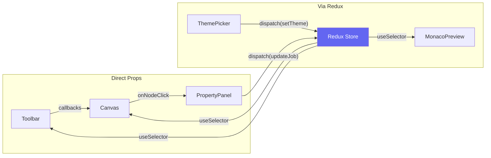

## Component Hierarchy

```mermaid
graph TD
    App["App.tsx"]
    App --> Toolbar["Toolbar"]
    App --> MainLayout["Main Layout"]
    App --> Overlays["Overlays / Modals"]

    subgraph "Toolbar (3 Sections)"
        Toolbar --> TL["Left: Brand, File Ops, Undo/Redo, Save"]
        Toolbar --> TC["Center: Add Job, Stages, Includes, Layout, Simulate"]
        Toolbar --> TR["Right: Search, Status, Push, Diff, Env, Templates, Theme"]
    end

    subgraph "Main Layout"
        MainLayout --> Canvas["Canvas (60%)"]
        MainLayout --> Monaco["MonacoPreview (40%)"]
    end

    subgraph "Canvas Components"
        Canvas --> JobNode["JobNode (per job)"]
        Canvas --> Edges["DependencyEdge (per needs)"]
        Canvas --> BG["Background (SVG)"]
        Canvas --> Minimap["Minimap"]
    end

    subgraph "Overlays / Modals"
        Overlays --> PP["PropertyPanel"]
        Overlays --> SM["StageManager"]
        Overlays --> IM["IncludeManager"]
        Overlays --> SP["SimulatorPanel"]
        Overlays --> GL["GitLabPushModal"]
        Overlays --> DV["DiffViewer"]
        Overlays --> EF["EnvironmentFlow"]
        Overlays --> TL2["TemplateLibrary"]
        Overlays --> WO["WelcomeOverlay"]
        Overlays --> BA["BulkActionsBar"]
        Overlays --> CD["CircularDependencyModal"]
    end

    style App fill:#6366f1,color:#fff
    style Canvas fill:#3b82f6,color:#fff
    style Monaco fill:#22c55e,color:#fff
```

## Component Groups

### Core Layout

| Component | Description |
|-----------|-------------|
| `App.tsx` | Root component, theme initialization, error boundary, layout |
| `Toolbar.tsx` | 3-section toolbar with all actions and status indicators |
| `Canvas.tsx` | React Flow canvas with nodes, edges, theme-reactive backgrounds |
| `MonacoPreview.tsx` | YAML preview with 7 custom Monaco themes |

### Job Editing

| Component | Description |
|-----------|-------------|
| `PropertyPanel.tsx` | Full sidebar for editing selected job properties (scripts, artifacts, cache, variables, rules, triggers, annotations) |
| `JobNode.tsx` | Individual job card rendered on the canvas — shows name, stage badge, script count, annotation |
| `AddJobButton.tsx` | Dropdown button for adding jobs to a specific stage |
| `ScriptSnippets.tsx` | Pre-built command snippet dropdown (npm, docker, kubectl, terraform) |

### Feature Modals

| Component | Description |
|-----------|-------------|
| `StageManager.tsx` | Add/remove/rename/reorder stages with icons and validation |
| `IncludeManager.tsx` | Manage external YAML includes (local, template, remote, project) |
| `SimulatorPanel.tsx` | Pipeline execution wave simulator with animation |
| `GitLabPushModal.tsx` | Push `.gitlab-ci.yml` to GitLab via API |
| `DiffViewer.tsx` | Compare current pipeline with saved snapshot or pasted YAML |
| `EnvironmentFlow.tsx` | Deployment environment visualization with approval gates |
| `CircularDependencyModal.tsx` | Cycle detection warning with dependency chain display |

### UI Components

| Component | Description |
|-----------|-------------|
| `ThemePicker.tsx` | Theme selection dropdown with 7 themes and `applyTheme()` utility |
| `WelcomeOverlay.tsx` | First-launch onboarding with 4 entry points |
| `TemplateLibrary.tsx` | Sidebar with searchable/filterable pipeline templates |
| `ValidationStatus.tsx` | Toolbar status indicator (Idle, Valid, Offline) |
| `BulkActionsBar.tsx` | Floating bar for multi-select bulk operations |
| `Tooltip.tsx` | Reusable tooltip wrapper |
| `YAMLParseErrorModal.tsx` | Import error display with line/column info |

## Component Communication

