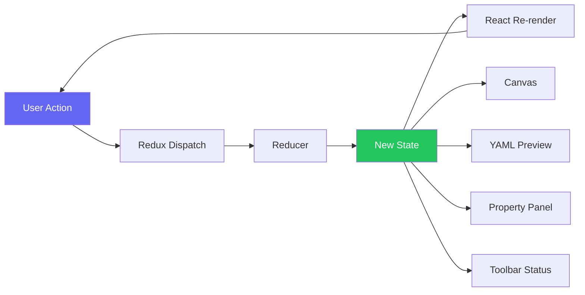
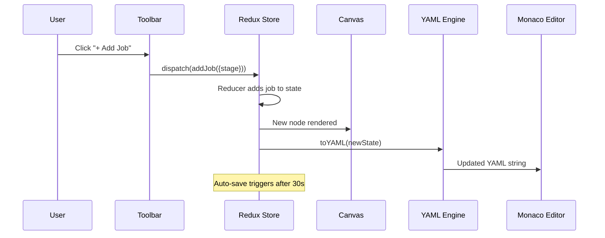
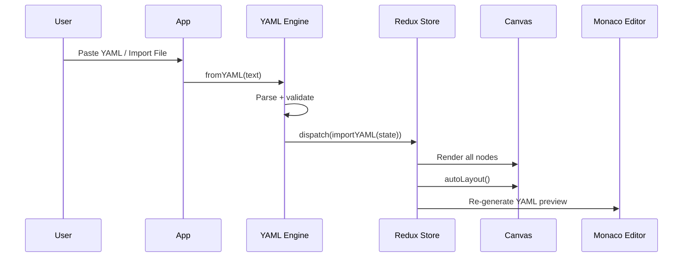
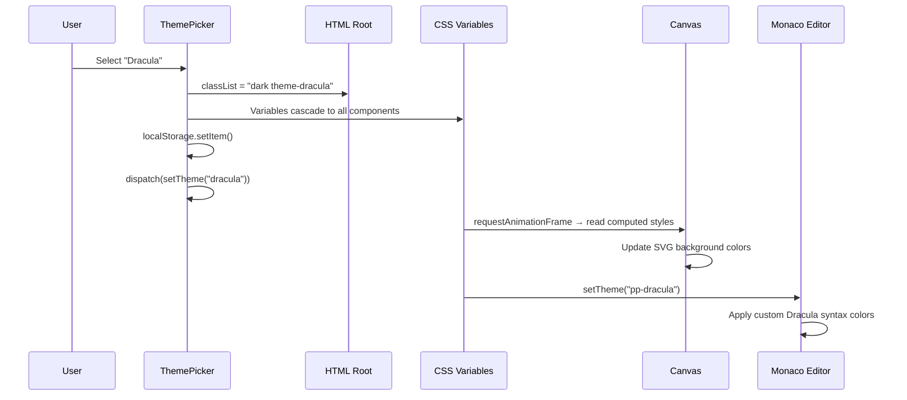
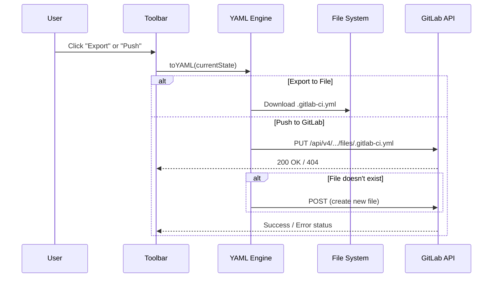
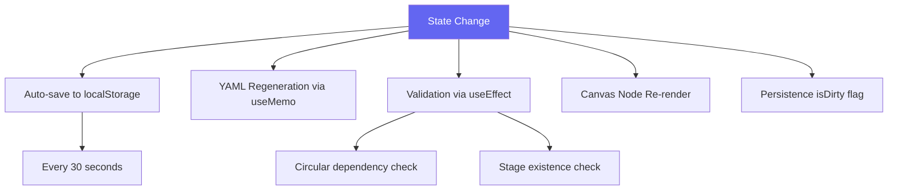

## Unidirectional Data Flow

PipelinePilot follows a strict unidirectional data flow pattern. Every user interaction follows the same predictable cycle:

## Key Data Paths

### Creating a Job

### Importing YAML

### Theme Change

### Export / GitLab Push

## Side Effects

