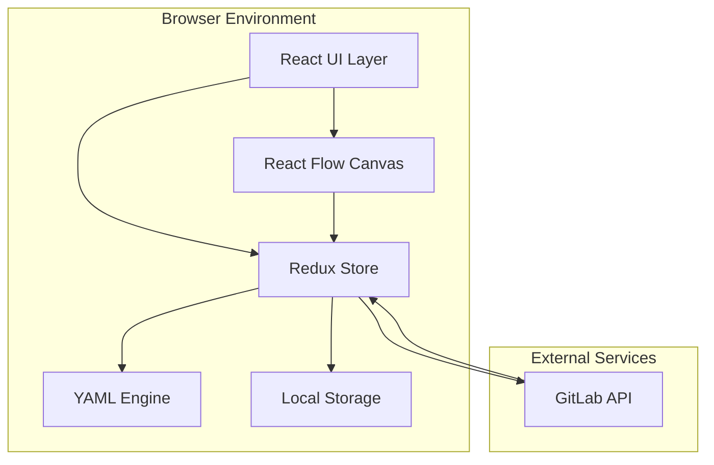
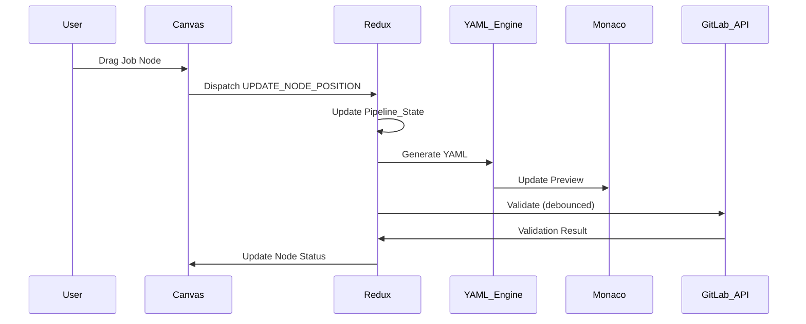
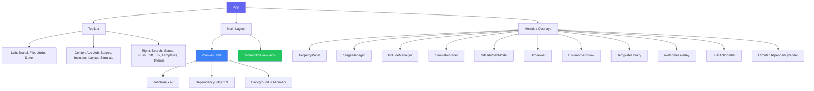

## System Architecture

PipelinePilot is a single-page application (SPA) built with React that runs entirely in the browser. It integrates with GitLab's API for validation and file push but works fully offline for core editing functionality.



## Core Principles

### 1. Visual-First Authoring

The canvas is the primary interface for pipeline composition. YAML is a synchronized output format, not the source of truth.

**Benefits:**
- Eliminates syntax errors
- Visualizes dependencies clearly
- Reduces cognitive load
- Faster pipeline creation

### 2. Real-Time Feedback

All changes propagate immediately through the system:

```
User Action → Redux State → YAML Generation → Monaco Preview
                ↓
         GitLab Validation (debounced)
                ↓
         Canvas Error Indicators
```

**Update Latency:**
- State update: < 10ms
- YAML generation: < 50ms
- Monaco preview: < 200ms
- GitLab validation: 500ms (debounced)

### 3. Bidirectional Fidelity

YAML import and export preserve semantic meaning:

```
YAML → Parser → Pipeline_State → Generator → YAML
```

**Preserved:**
- All job configuration
- Dependencies (needs, dependencies)
- Global configuration
- Stage ordering

**Not Preserved:**
- Comments (best effort)
- Formatting preferences
- Include directives (expanded)

### 4. Progressive Disclosure

Complex configuration options are accessible through contextual panels without cluttering the main interface:

- **Canvas**: High-level pipeline structure
- **Property Panel**: Detailed job configuration
- **Monaco Preview**: Generated YAML output
- **Template Library**: Reusable patterns

### 5. Offline-First

Core functionality works without internet:

**Offline Capabilities:**
- ✅ Create and edit pipelines
- ✅ YAML generation and export
- ✅ Local storage persistence
- ✅ Undo/redo
- ✅ Cached templates

**Requires Internet:**
- ❌ GitLab API validation
- ❌ Fetching new templates
- ❌ Multi-project pipeline triggers

## Technology Stack

### Frontend Framework

**React 18+ with TypeScript**

- Component-based architecture
- Strong typing for reliability
- Hooks for state management
- Concurrent rendering for performance

**Why React?**
- Large ecosystem of libraries
- Excellent developer experience
- Strong TypeScript support
- Battle-tested in production

### Canvas Library

**React Flow**

- Purpose-built for node-based editors
- Built-in DAG support
- Extensible node and edge rendering
- Zoom, pan, and selection out of the box

**Why React Flow?**
- Designed for visual editors
- Handles complex interactions
- Performance optimized
- Active maintenance

### State Management

**Redux Toolkit**

- Centralized state management
- Immutable updates with Immer
- Built-in DevTools integration
- Middleware for side effects

**Why Redux?**
- Predictable state updates
- Time-travel debugging
- Middleware ecosystem
- Undo/redo support (redux-undo)

### YAML Processing

**js-yaml**

- Mature YAML 1.2 parser
- Supports anchors and aliases
- Customizable serialization
- Error reporting with line numbers

**Why js-yaml?**
- Industry standard
- Full YAML spec support
- Reliable and well-tested
- Active maintenance

### Code Editor

**Monaco Editor**

- Same engine as VS Code
- Full language support
- Syntax highlighting
- Code folding and minimap

**Why Monaco?**
- Professional-grade editor
- Familiar to developers
- Extensive customization
- Excellent performance

### Styling

**Tailwind CSS + CSS Variable Theme Engine**

- Utility-first CSS framework
- 7 built-in themes (Light, Midnight, Dracula, Nord, Monokai, Synthwave, GitHub Dark)
- CSS custom properties (`--bg-primary`, `--accent`, etc.) for runtime theme switching
- Custom Monaco editor themes per app theme

**Why CSS Variables over Tailwind theming?**
- Runtime switching without rebuild
- React Flow SVG backgrounds can read computed styles
- Monaco editor themes need programmatic color values
- Single source of truth for all component colors

### HTTP Client

**Axios**

- Promise-based HTTP client
- Request/response interceptors
- Automatic JSON transformation
- Request cancellation

**Why Axios?**
- Simple API
- Error handling
- Interceptor support
- Wide adoption

## Data Flow

### User Interaction Flow



### State Update Flow

1. **User Action**: User interacts with UI (drag node, edit form, etc.)
2. **Action Dispatch**: Component dispatches Redux action
3. **Reducer**: Redux reducer updates state immutably
4. **Subscribers**: Components re-render with new state
5. **Side Effects**: Middleware triggers side effects (YAML generation, validation, auto-save)

### YAML Generation Flow

```typescript
Pipeline_State
  ↓
Remove UI Metadata
  ↓
Detect Repeated Config
  ↓
Generate Anchors
  ↓
Substitute Aliases
  ↓
Order Jobs by Stage
  ↓
Serialize to YAML
  ↓
Monaco Editor
```

## Component Architecture

### Component Hierarchy



### Component Responsibilities

<AccordionGroup>
  <Accordion title="App Component" icon="window">
    - Root component
    - Redux Provider setup
    - Theme management
    - Global error boundary
    - Route handling (if applicable)
  </Accordion>
  
  <Accordion title="Canvas Component" icon="diagram-project">
    - React Flow integration
    - Node and edge rendering
    - Drag and drop handling
    - Zoom and pan controls
    - Selection management
    - Cycle detection
  </Accordion>
  
  <Accordion title="Property Panel" icon="sliders">
    - Job configuration forms
    - Field validation
    - Real-time state updates
    - Contextual help text
    - Save/cancel actions
  </Accordion>
  
  <Accordion title="Monaco Preview" icon="code">
    - Monaco Editor integration
    - YAML syntax highlighting
    - Real-time YAML updates
    - Read-only mode
    - Theme synchronization
  </Accordion>
  
  <Accordion title="Template Library" icon="layer-group">
    - Template search and filtering
    - Template preview
    - Drag-and-drop application
    - Custom template management
    - GitLab template fetching
  </Accordion>
</AccordionGroup>

## State Management

### Redux Store Structure

```typescript
{
  pipeline: {
    present: Pipeline_State,
    past: Pipeline_State[],
    future: Pipeline_State[]
  },
  ui: {
    selectedNodeId: string | null,
    propertyPanelOpen: boolean,
    templateLibraryOpen: boolean,
    validationStatus: 'idle' | 'validating' | 'valid' | 'invalid' | 'offline',
    validationErrors: Record<string, string[]>,
    theme: 'light' | 'midnight' | 'dracula' | 'nord' | 'monokai' | 'synthwave' | 'github-dark',
    searchQuery: string
  },
  templates: {
    official: Template[],
    custom: Template[],
    loading: boolean,
    error: string | null
  },
  persistence: {
    lastSaved: string | null,
    isDirty: boolean,
    autoSaveEnabled: boolean
  }
}
```

### Middleware

<CardGroup cols={2}>
  <Card title="Auto-Save Middleware" icon="floppy-disk">
    Saves Pipeline_State to localStorage on every change (debounced)
  </Card>
  <Card title="Validation Middleware" icon="check">
    Triggers GitLab API validation on Pipeline_State changes (debounced)
  </Card>
  <Card title="Logger Middleware" icon="file-lines">
    Logs actions and state changes for debugging (dev only)
  </Card>
  <Card title="Error Middleware" icon="triangle-exclamation">
    Catches and reports errors from async actions
  </Card>
</CardGroup>

## Performance Optimizations

### React Optimizations

- **React.memo**: Memoize JobNode and DependencyEdge components
- **useMemo**: Memoize YAML generation and expensive computations
- **useCallback**: Memoize event handlers to prevent re-renders
- **Code Splitting**: Lazy load Monaco Editor and Template Library

### Redux Optimizations

- **Normalized State**: Store jobs as Record<id, Job> for O(1) lookups
- **Selector Memoization**: Use reselect for derived state
- **Batched Updates**: Batch multiple state updates into single render

### Canvas Optimizations

- **Virtualization**: Only render visible nodes for large pipelines
- **Debounced Updates**: Debounce position updates during drag
- **Throttled Validation**: Throttle GitLab API calls to avoid rate limits

### Bundle Optimizations

- **Tree Shaking**: Remove unused code with Vite
- **Code Splitting**: Split vendor and app bundles
- **Lazy Loading**: Load Monaco Editor on demand
- **Asset Optimization**: Compress images and fonts

## Security Considerations

### Data Privacy

- **Local Storage Only**: Pipeline data never leaves the browser (except GitLab API)
- **No Analytics**: No tracking or telemetry
- **No Server**: No backend to compromise

### GitLab API Security

- **Token Storage**: Personal access tokens stored in localStorage (encrypted in future)
- **HTTPS Only**: All API calls over HTTPS
- **Token Scoping**: Recommend minimal scopes (api read-only)
- **Token Rotation**: Encourage regular token rotation

### XSS Prevention

- **React Escaping**: React automatically escapes user input
- **Content Security Policy**: CSP headers prevent inline scripts
- **Sanitization**: Sanitize YAML input before parsing

## Scalability

### Large Pipelines

The application is designed to handle pipelines with 100+ jobs:

- **Virtualization**: Only render visible nodes
- **Efficient Rendering**: Memoized components prevent unnecessary re-renders
- **Optimized State**: Normalized state structure for fast lookups
- **Lazy Loading**: Load template library on demand

### Performance Benchmarks

| Operation | Target | Actual |
|-----------|--------|--------|
| YAML Generation (100 jobs) | < 100ms | ~80ms |
| Canvas Rendering (100 nodes) | 60fps | 60fps |
| Undo/Redo | < 50ms | ~30ms |
| Auto-Save | < 20ms | ~15ms |
| State Update | < 10ms | ~5ms |

## Deployment Architecture

### Static Hosting

The application is a static SPA that can be hosted anywhere:

- **GitHub Pages**: Free hosting for open source
- **Netlify**: Automatic deployments from Git
- **Vercel**: Edge network for global performance
- **AWS S3 + CloudFront**: Enterprise-grade hosting
- **Self-Hosted**: Nginx or Apache

### Build Process

```bash
npm run build
  ↓
Vite Build
  ↓
TypeScript Compilation
  ↓
Asset Optimization
  ↓
Bundle Generation
  ↓
dist/ folder (ready to deploy)
```

## Next Steps

<CardGroup cols={2}>
  <Card
    title="Tech Stack Details"
    icon="layer-group"
    href="/architecture/tech-stack"
  >
    Deep dive into each technology choice
  </Card>
  <Card
    title="Data Flow"
    icon="diagram-project"
    href="/architecture/data-flow"
  >
    Detailed data flow diagrams
  </Card>
  <Card
    title="State Management"
    icon="database"
    href="/architecture/state-management"
  >
    Redux store structure and patterns
  </Card>
  <Card
    title="Components"
    icon="puzzle-piece"
    href="/architecture/components"
  >
    Component architecture and responsibilities
  </Card>
</CardGroup>
