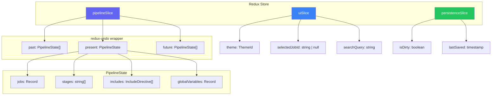
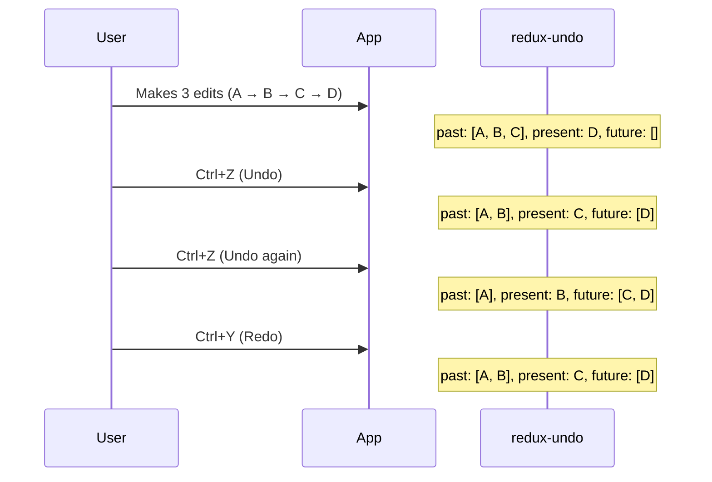
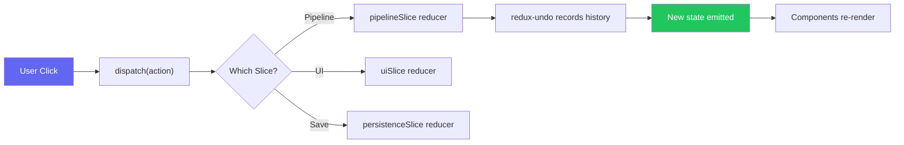

## Store Architecture

## Redux Slices

PipelinePilot uses three Redux slices:

| Slice | Purpose | Key State |
|-------|---------|-----------| 
| `pipelineSlice` | Pipeline data (wrapped in `redux-undo`) | `jobs`, `stages`, `includes`, `globalVariables` |
| `uiSlice` | UI state | `theme`, `selectedJobId`, `searchQuery`, `templateLibraryOpen` |
| `persistenceSlice` | Save tracking | `isDirty`, `lastSaved` |

## Undo/Redo

The `pipelineSlice` is wrapped in `redux-undo`, providing:

- **50-state history** — configurable via `undoableOptions.limit`
- **Undo**: `Ctrl+Z` dispatches `ActionCreators.undo()`
- **Redo**: `Ctrl+Y` dispatches `ActionCreators.redo()`
- State shape: `{ past: [], present: PipelineState, future: [] }`

## Key Actions

### Pipeline Actions
| Action | Purpose |
|--------|---------|
| `addJob` | Add a new job with defaults |
| `updateJob` | Modify job properties |
| `removeJob` | Delete a job and clean up deps |
| `duplicateJob` | Clone with `_copy` suffix |
| `importYAML` | Replace entire state from parsed YAML |
| `clearPipeline` | Reset to empty pipeline |
| `autoLayout` | Rearrange all jobs by stage |
| `updateStages` | Modify the stage list |
| `addInclude` / `removeInclude` | Manage include directives |

### UI Actions
| Action | Purpose |
|--------|---------|
| `setTheme` | Switch theme (Midnight, Dracula, etc.) |
| `selectJob` | Set active job for property panel |
| `setSearchQuery` | Filter jobs by name |
| `toggleTemplateLibrary` | Open/close template sidebar |

## Action Flow

