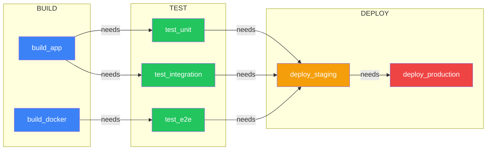
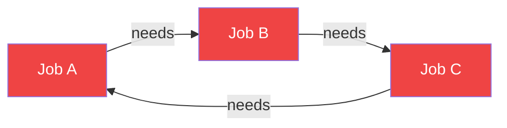

## Overview

GitLab CI/CD pipelines have two dependency systems, and PipelinePilot models both visually:

1. **Stage-based ordering** — Jobs in later stages wait for all jobs in earlier stages
2. **`needs` keyword** — Explicit DAG (Directed Acyclic Graph) dependencies between specific jobs

## Visual Representation

| Dependency Type | Visual | Behavior |
|----------------|--------|----------|
| **Stage order** | Horizontal swim lanes (BUILD → TEST → DEPLOY) | Implicit — all jobs in `test` wait for all `build` jobs |
| **`needs` edges** | Animated gradient arrows between nodes | Explicit — only the named jobs must complete first |

## Example Pipeline Graph



## Circular Dependency Detection

The engine detects cycles in the dependency graph using depth-first traversal:



When a cycle is found:

1. A **CircularDependencyModal** shows the full chain (e.g., `A → B → C → A`)
2. Affected edges are highlighted in red
3. Export is blocked until the cycle is resolved

## Execution Waves

The Pipeline Simulator computes **execution waves** — groups of jobs that can run in parallel:

```mermaid
gantt
    title Pipeline Execution Timeline
    dateFormat X
    axisFormat %s

    section Wave 1
    build_app      :a, 0, 3
    build_docker   :b, 0, 4

    section Wave 2
    test_unit      :c, 4, 6
    test_integration :d, 4, 7
    test_e2e       :e, 4, 8

    section Wave 3
    deploy_staging :f, 8, 10

    section Wave 4
    deploy_production :g, 10, 12
```



```
Wave 1: [build_app, build_docker]     ← No dependencies, run in parallel
Wave 2: [test_unit, test_integration] ← Need build jobs
Wave 3: [deploy_staging]              ← Needs test jobs
Wave 4: [deploy_production]           ← Needs staging (manual gate)
```

<Tip>
  Use the **Simulate** button to animate execution waves and see which jobs run in parallel vs sequentially.
</Tip>
