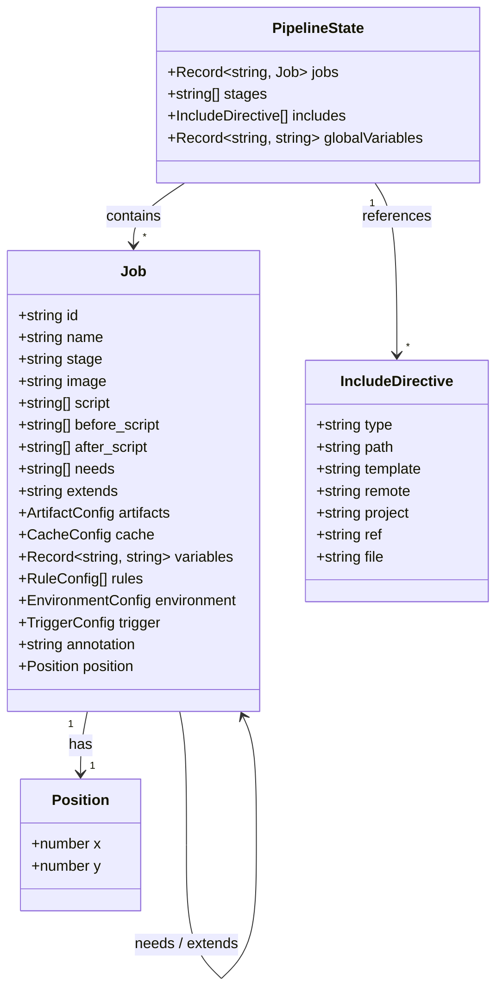
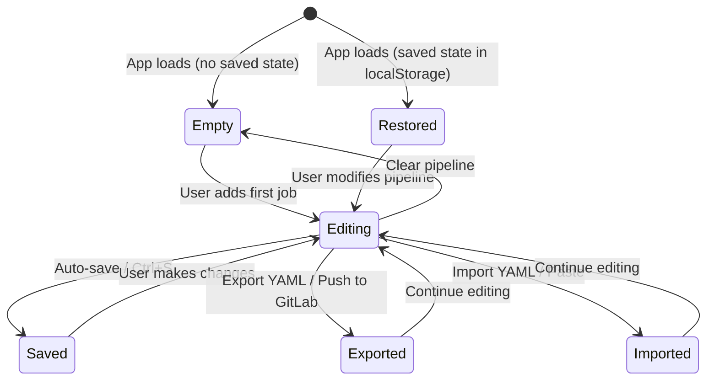

## Overview

The `PipelineState` is the central data model that represents your entire CI/CD pipeline. Every job, stage, include directive, and configuration lives inside this single Redux state object.

## Data Structure



```typescript
interface PipelineState {
  jobs: Record<string, Job>;           // All jobs, keyed by ID
  stages: string[];                     // Ordered stage list
  includes: IncludeDirective[];         // External YAML references
  globalVariables: Record<string, string>; // Pipeline-level variables
}

interface Job {
  id: string;
  name: string;
  stage: string;
  image?: string;
  script: string[];
  before_script?: string[];
  after_script?: string[];
  needs?: string[];
  extends?: string;
  artifacts?: ArtifactConfig;
  cache?: CacheConfig;
  variables?: Record<string, string>;
  rules?: RuleConfig[];
  environment?: EnvironmentConfig;
  trigger?: TriggerConfig;
  annotation?: string;
  position: { x: number; y: number };
}
```

## State Lifecycle



## Persistence

- **Auto-save**: Pipeline state is saved to `localStorage` every 30 seconds
- **Manual save**: `Ctrl+S` saves immediately
- **Undo/Redo**: 50-state history via `redux-undo`

<Note>
  The pipeline state is serializable JSON, making it easy to save, export, and restore across sessions.
</Note>
