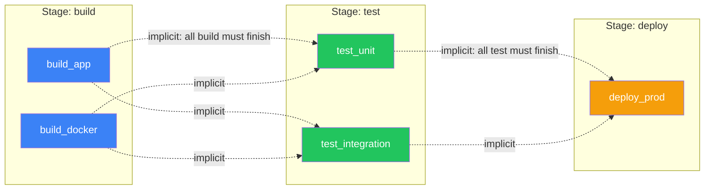
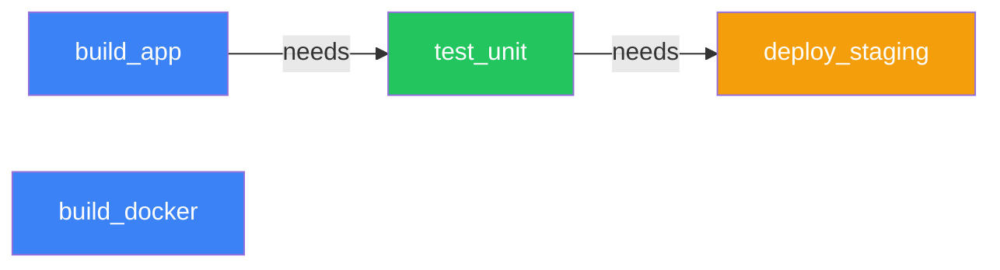
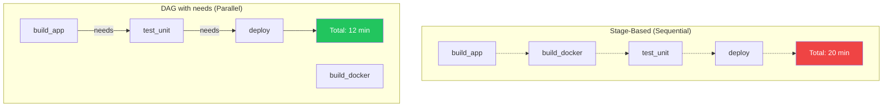

## Two Dependency Models

GitLab CI/CD supports two complementary dependency systems. PipelinePilot visualizes both.

### Stage-Based (Default)

By default, jobs are grouped into **stages** that run sequentially:



```yaml
stages:
  - build
  - test
  - deploy

build_app:
  stage: build      # Runs first

test_unit:
  stage: test       # Runs after ALL build jobs finish

deploy_prod:
  stage: deploy     # Runs after ALL test jobs finish
```

**In PipelinePilot**: Stages are shown as horizontal swim lanes (BUILD, TEST, DEPLOY labels on the left side of the canvas).

### `needs` (DAG Mode)

The `needs` keyword creates **explicit dependencies** between specific jobs, enabling parallelism:



In this example, `test_unit` starts as soon as `build_app` finishes — it does **not** wait for `build_docker`. This enables significantly faster pipelines.

```yaml
build_app:
  stage: build

build_docker:
  stage: build

test_unit:
  stage: test
  needs: [build_app]     # Only waits for build_app, not build_docker

deploy_staging:
  stage: deploy
  needs: [test_unit]     # Starts as soon as test_unit finishes
```

**In PipelinePilot**: `needs` dependencies are shown as animated gradient arrows between job nodes.

## Side-by-Side Comparison



## When to Use Which

| Scenario | Recommendation |
|----------|---------------|
| Simple linear pipeline | Stages only |
| Complex with parallelism | `needs` for DAG control |
| Mixed | Stages for grouping + `needs` for fine-grained deps |

<Tip>
  Use the **Pipeline Simulator** to visualize exactly which jobs run in parallel with your current configuration.
</Tip>
