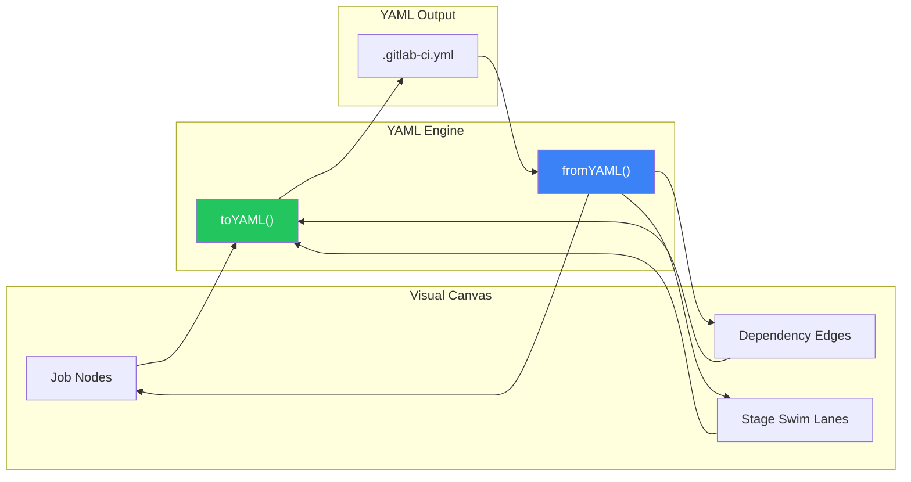
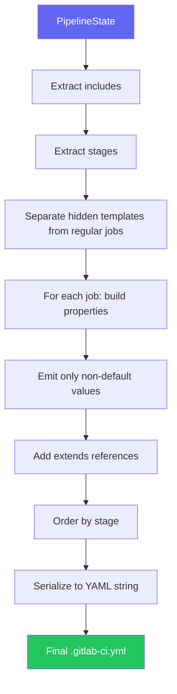
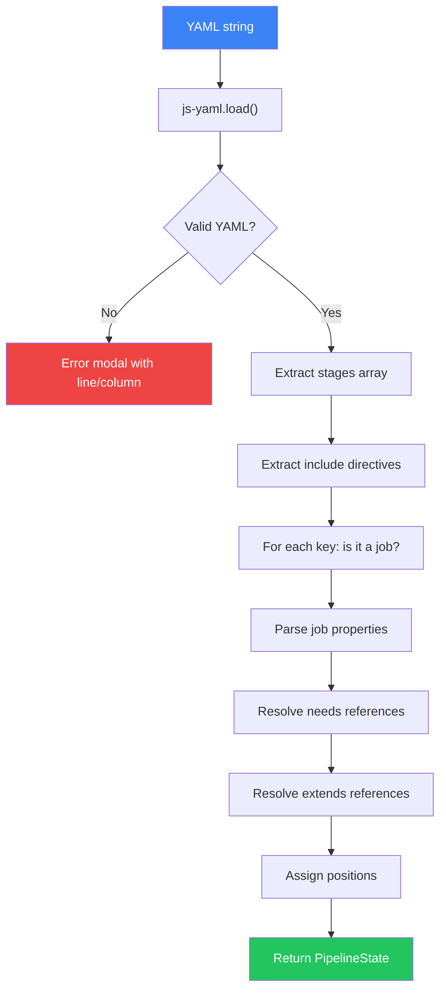
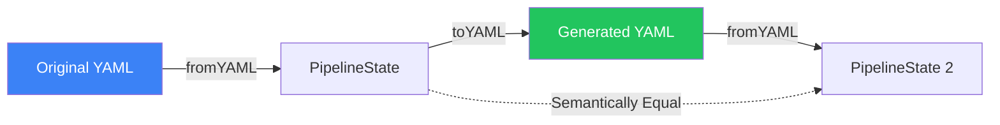

## Overview

The YAML Engine is the bidirectional translation layer between the visual canvas and `.gitlab-ci.yml` text. It handles both **serialization** (state → YAML) and **deserialization** (YAML → state).

## Bidirectional Flow



## Key Functions

| Function | Direction | Purpose |
|----------|-----------|---------|
| `toYAML(state)` | State → YAML | Generates optimized `.gitlab-ci.yml` |
| `fromYAML(text)` | YAML → State | Parses YAML into PipelineState |

## Serialization (`toYAML`)



The engine produces clean, production-ready YAML:

1. **Include directives** are rendered at the top
2. **Stages** are listed in order
3. **Hidden templates** (`.base_*` jobs) come before regular jobs
4. **Job properties** are emitted only when non-default
5. **Extends** references are preserved

```yaml
# Example output
include:
  - template: Auto-DevOps.gitlab-ci.yml

stages:
  - build
  - test
  - deploy

.base_docker:
  image: docker:24
  services:
    - docker:24-dind

build_app:
  extends: .base_docker
  stage: build
  script:
    - docker build -t $IMAGE .
```

## Deserialization (`fromYAML`)



The parser handles:

- Standard job properties (stage, script, image, artifacts, etc.)
- `include` directives (local, template, remote, project)
- `extends` references
- `needs` dependencies
- Environment and trigger configurations
- Global variables

<Warning>
  The parser validates structure during import. If YAML contains syntax errors, a detailed error modal shows the line and column of the issue.
</Warning>

## Round-Trip Fidelity



**Preserved:**
- All job configuration and properties
- Dependencies (`needs`, `extends`)
- Include directives and stage ordering

**Not Preserved:**
- YAML comments (limitation of js-yaml)
- Original formatting preferences
- Whitespace style

## Source

The engine is implemented in [`src/engine/yaml-engine.ts`](https://github.com/vedantchimote/PipelinePilot/blob/main/src/engine/yaml-engine.ts) using the `js-yaml` library.
