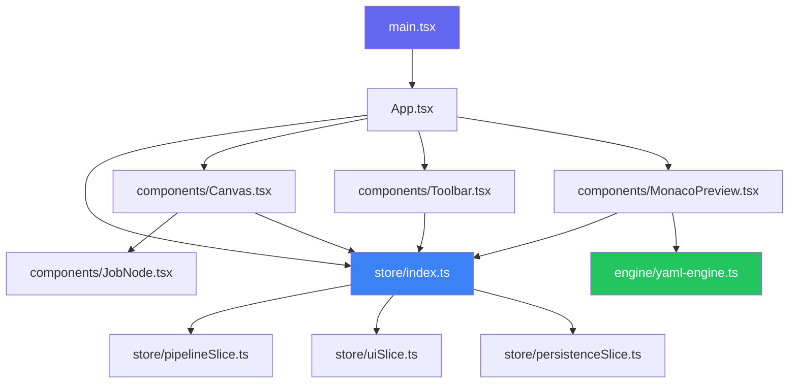

## Top-Level Structure

```
PipelinePilot/
├── docs/                  # Mintlify documentation
├── public/                # Static assets (icon.svg)
├── src/
│   ├── components/        # React components (~30 files)
│   ├── engine/            # YAML engine (yaml-engine.ts)
│   ├── store/             # Redux slices and store config
│   ├── utils/             # Helper functions
│   ├── App.tsx            # Root component
│   ├── main.tsx           # Entry point
│   └── index.css          # Global styles and theme variables
├── index.html             # HTML entry with favicon
├── package.json
├── tsconfig.json
├── vite.config.ts
└── tailwind.config.js
```

## Key Directories

### `src/components/`

| File | Purpose |
|------|---------|
| `Canvas.tsx` | React Flow canvas with node/edge rendering |
| `Toolbar.tsx` | Main toolbar (3-section layout) |
| `PropertyPanel.tsx` | Job configuration sidebar |
| `MonacoPreview.tsx` | YAML preview with 7 custom themes |
| `ThemePicker.tsx` | Theme definitions and picker UI |
| `JobNode.tsx` | Individual job card component |
| `StageManager.tsx` | Stage add/remove/reorder modal |
| `SimulatorPanel.tsx` | Pipeline execution simulator |
| `WelcomeOverlay.tsx` | First-launch onboarding |

### `src/store/`

| File | Purpose |
|------|---------|
| `index.ts` | Store configuration and typed hooks |
| `pipelineSlice.ts` | Pipeline state with undo/redo |
| `uiSlice.ts` | Theme, selection, search state |
| `persistenceSlice.ts` | Auto-save tracking |

### `src/engine/`

| File | Purpose |
|------|---------|
| `yaml-engine.ts` | `toYAML()` and `fromYAML()` functions |

## Module Dependencies



