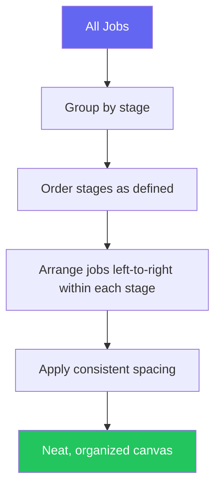

## Overview

Auto-Layout instantly arranges all nodes on the canvas into neat, readable rows grouped by stage. Perfect for cleaning up after heavy editing or after importing a large YAML file.

## How to Use

<Steps>
  <Step title="Click 'Layout' in the center toolbar">
    All nodes immediately snap to organized positions — no configuration needed.
  </Step>
</Steps>

That's it — one click.

## Layout Algorithm



### Spacing Constants

| Parameter | Value |
|-----------|-------|
| Node width | 280px |
| Horizontal gap between nodes | 40px |
| Vertical gap between stage groups | 200px |
| Starting position | (100, 100) |

### Before & After

**Before** (messy after heavy editing):
```
          [test_e2e]
  [build_app]                    [deploy_prod]
                [test_unit]
       [build_docker]
                              [deploy_staging]
```

**After** (auto-layout applied):
```
BUILD    ──  [build_app]  [build_docker]

TEST     ──  [test_unit]  [test_e2e]

DEPLOY   ──  [deploy_staging]  [deploy_prod]
```

## When to Use

- After **importing** a large YAML file (auto-layout runs automatically on import)
- After **bulk operations** that scatter nodes
- When starting a **new pipeline from a template**
- Whenever the canvas feels **cluttered or hard to read**
- After **adding many new jobs** in sequence

<Note>
  Auto-Layout preserves all dependencies, configurations, and scripts — it only changes node positions on the canvas. Your YAML output is unaffected.
</Note>
