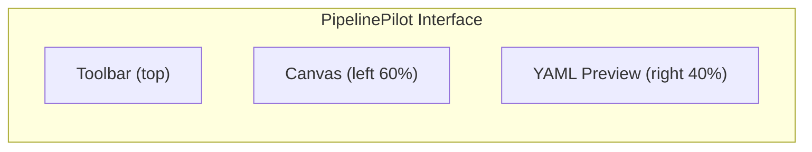

## Welcome to PipelinePilot

This guide walks you through **every feature** of PipelinePilot, step by step. By the end, you'll know how to build, configure, simulate, and deploy GitLab CI/CD pipelines entirely from the visual editor.

---

## 1. First Launch & Onboarding

When you open PipelinePilot for the first time, a **Welcome Overlay** appears with four entry points:

<Steps>
  <Step title="Hello World">
    Creates a minimal pipeline with one `build` job — perfect for trying the editor
  </Step>
  <Step title="Start from Scratch">
    Opens a blank canvas with default stages (`build`, `test`, `deploy`) — for building from zero
  </Step>
  <Step title="Import YAML">
    Opens a file picker to load an existing `.gitlab-ci.yml` — for editing real pipelines
  </Step>
  <Step title="Template Library">
    Opens the sidebar with 10+ pre-built pipeline templates — for starting from proven patterns
  </Step>
</Steps>

<Tip>
  Choose **"Start from Scratch"** to follow along with this guide.
</Tip>

---

## 2. Understanding the Interface

After dismissing the welcome overlay, you'll see three main areas:



### Toolbar (3 Sections)

| Section | Items | Purpose |
|---------|-------|---------|
| **Left** | Brand, New, Import, Export, Undo, Redo, Save | File operations |
| **Center** | + Add Job, Stages, Includes, Layout, Simulate | Pipeline building |
| **Right** | Search, Status, Push, Diff, Env Flow, Templates, Settings, Theme | Advanced tools |

### Canvas

The main editing area where job nodes appear as draggable cards. Key controls:

- **Pan**: Click and drag on empty canvas area
- **Zoom**: Scroll wheel up/down
- **Select**: Click a job node to open its PropertyPanel
- **Connect**: Drag from one node's handle to another to create a `needs` dependency
- **Fit to View**: Click the `⊡` button (bottom-left)

### YAML Preview

A read-only Monaco editor showing the live `.gitlab-ci.yml` output. It updates in real time (<200ms) as you make changes on the canvas. The editor's syntax highlighting matches your selected theme.

---

## 3. Adding Jobs

### Method 1: Add Job Button

<Steps>
  <Step title="Click '+ Add Job'">
    In the center of the toolbar, click the green **+ Add Job** button
  </Step>
  <Step title="A new node appears">
    A new job card appears on the canvas with a default name like `job_1`
  </Step>
  <Step title="Configure it">
    Click the node to open the PropertyPanel on the left side
  </Step>
</Steps>

### Method 2: From a Template

<Steps>
  <Step title="Open Template Library">
    Click the **Templates** icon (grid icon) in the right toolbar section
  </Step>
  <Step title="Browse or Filter">
    Use the search bar or filter by category (Node.js, Python, Docker, etc.)
  </Step>
  <Step title="Click a Template">
    Click any template to instantly import the entire pipeline onto the canvas
  </Step>
</Steps>

### Method 3: Duplicate an Existing Job

<Steps>
  <Step title="Right-click a job node">
    A context menu appears with three options
  </Step>
  <Step title="Click 'Duplicate Job'">
    A copy is created with the suffix `_copy` (e.g., `build_app` → `build_app_copy`)
  </Step>
  <Step title="Rename and reconfigure">
    Click the new node to change its name and settings
  </Step>
</Steps>

---

## 4. Configuring Jobs

Click any job node to open the **PropertyPanel** on the left side. It has three tabs:

### Basic Tab

| Field | What It Does | Example |
|-------|-------------|---------|
| **Job Name** | Unique identifier for the job | `build_frontend` |
| **Stage** | Which pipeline stage the job belongs to | `build` |
| **Image** | Docker image to run the job in | `node:20-alpine` |
| **Extends** | Inherit from a hidden template job | `.base_docker` |

<Steps>
  <Step title="Change the name">
    Clear the default name and type something descriptive like `build_frontend`
  </Step>
  <Step title="Set the stage">
    Select `build` from the Stage dropdown
  </Step>
  <Step title="Set the Docker image">
    Type `node:20-alpine` in the Image field
  </Step>
  <Step title="Save">
    Click **Save Changes** at the bottom of the panel
  </Step>
</Steps>

### Scripts Tab

| Field | Purpose | Runs When |
|-------|---------|-----------|
| **Script** | Main job commands | During job execution |
| **Before Script** | Setup commands | Before main script |
| **After Script** | Cleanup commands | Always (even on failure) |

#### Adding Scripts Manually

Type each command on a new line in the Script textarea:

```bash
npm ci
npm run build
npm run test
```

#### Using Script Snippets

<Steps>
  <Step title="Click the 'Snippets' dropdown">
    Located next to the Script textarea
  </Step>
  <Step title="Browse categories">
    Package Managers, Build Tools, Deployment, Testing
  </Step>
  <Step title="Click a snippet">
    The command is appended to your existing script
  </Step>
</Steps>

#### Using AI Script Helper

<Steps>
  <Step title="Click the purple 'AI' button">
    Located next to the Snippets dropdown
  </Step>
  <Step title="Describe the task">
    Type what the job should do: *"Build a Node.js app and run unit tests"*
  </Step>
  <Step title="Or use a suggestion chip">
    Click a pre-built suggestion like "Build a Node.js application"
  </Step>
  <Step title="Review the preview">
    See the generated script commands and recommended Docker image
  </Step>
  <Step title="Click 'Apply to Job'">
    The script and image are applied to the current job (scripts are appended, not replaced)
  </Step>
</Steps>

<Note>
  The AI Helper supports 18+ tech stacks: Node.js, Python, Docker, Kubernetes, Terraform, Go, Rust, Java, Helm, AWS, Ansible, and more. No external API needed — it runs entirely locally.
</Note>

### Advanced Tab

| Field | Purpose |
|-------|---------|
| **Artifacts** | Files to preserve between stages (e.g., `dist/`, `coverage/`) |
| **Cache** | Cached directories for faster builds (e.g., `node_modules/`) |
| **Variables** | Job-specific environment variables |
| **Rules** | Conditional execution rules (e.g., only on `main` branch) |
| **Needs** | Explicit dependencies on other jobs (DAG mode) |
| **Trigger** | Multi-project pipeline triggers |
| **Annotation** | Internal notes visible on the canvas (not in YAML output) |

---

## 5. Creating Dependencies

Dependencies control job execution order. PipelinePilot supports two types:

### Stage-Based Dependencies (Automatic)

Jobs in the same stage run in parallel. Jobs in later stages wait for all jobs in earlier stages to finish.

```
BUILD stage:  build_app, build_docker  ← Run in parallel
TEST stage:   test_unit, test_e2e      ← Wait for ALL build jobs
DEPLOY stage: deploy_prod              ← Waits for ALL test jobs
```

You configure this simply by **assigning jobs to stages** in the PropertyPanel.

### `needs` Dependencies (Explicit DAG)

For fine-grained control, create explicit edges between nodes:

<Steps>
  <Step title="Hover over a job node">
    Small blue circles (handles) appear at the top and bottom of the node
  </Step>
  <Step title="Drag from the bottom handle of the source job">
    A connection line follows your cursor
  </Step>
  <Step title="Drop on the top handle of the target job">
    An animated gradient arrow appears, and `needs: [source_job]` is added to the YAML
  </Step>
</Steps>

To **remove** a dependency: click the edge arrow, then press `Delete`.

<Tip>
  Using `needs` allows jobs to start as soon as their specific dependencies complete, rather than waiting for the entire previous stage. This can significantly speed up your pipeline.
</Tip>

---

## 6. Managing Stages

### Default Stages

PipelinePilot starts with three default stages: `build`, `test`, `deploy`.

### Custom Stages via Stage Manager

<Steps>
  <Step title="Click 'Stages' in the center toolbar">
    The Stage Manager modal opens
  </Step>
  <Step title="Add a stage">
    Type a name (e.g., `lint`) in the input field and click the **+** button
  </Step>
  <Step title="Reorder stages">
    Stages are numbered — they execute in the listed order
  </Step>
  <Step title="Rename a stage">
    Click on any stage name to edit it inline
  </Step>
  <Step title="Delete a stage">
    Click the trash icon next to any stage (jobs in that stage will need reassignment)
  </Step>
  <Step title="Apply changes">
    Click **Apply** — stage swim lanes on the canvas update immediately
  </Step>
</Steps>

**Common custom stages:** `lint`, `scan`, `package`, `release`, `cleanup`, `notify`

---

## 7. Using Templates

### Opening the Template Library

Click the **Templates** button (grid icon) in the right toolbar section. A sidebar slides in from the left.

### Browsing Templates

<Steps>
  <Step title="Search by name">
    Type in the search bar to filter templates (e.g., "Node", "Docker")
  </Step>
  <Step title="Filter by category">
    Click category buttons: **All**, **Web**, **Docker**, **Cloud**, **Security**, etc.
  </Step>
  <Step title="Preview">
    Each template card shows the name, description, number of jobs, and stages used
  </Step>
  <Step title="Apply">
    Click a template card to load it onto the canvas. This replaces the current pipeline.
  </Step>
</Steps>

<Warning>
  Applying a template replaces your current pipeline. Save or export your work first if needed.
</Warning>

---

## 8. Import & Export

### Importing an Existing Pipeline

#### Method 1: File Import

<Steps>
  <Step title="Click 'Import' in the toolbar">
    A file picker dialog opens
  </Step>
  <Step title="Select a .yml or .yaml file">
    Choose your existing `.gitlab-ci.yml` file
  </Step>
  <Step title="Auto-parse and layout">
    The YAML is parsed, jobs are created on the canvas, and Auto-Layout arranges them
  </Step>
</Steps>

#### Method 2: Clipboard Paste

<Steps>
  <Step title="Copy YAML to clipboard">
    In your terminal or text editor, copy the contents of a `.gitlab-ci.yml`
  </Step>
  <Step title="Click on the canvas">
    Make sure no input field is focused (click empty canvas area)
  </Step>
  <Step title="Press Ctrl+V">
    PipelinePilot auto-detects YAML by looking for keywords like `stages:`, `script:`, or `stage:`
  </Step>
  <Step title="Pipeline imports automatically">
    A toast notification confirms successful import
  </Step>
</Steps>

### Exporting Your Pipeline

<Steps>
  <Step title="Click 'Export' in the toolbar">
    The current pipeline is generated as optimized YAML
  </Step>
  <Step title="Download">
    A `.gitlab-ci.yml` file downloads to your default download directory
  </Step>
</Steps>

Or press `Ctrl+E` for a quick export shortcut.

---

## 9. Includes & Extends

### Managing Includes

Real-world pipelines often reference external YAML files. PipelinePilot's Include Manager handles all four GitLab include types:

<Steps>
  <Step title="Click 'Includes' in the center toolbar">
    The Include Manager modal opens
  </Step>
  <Step title="Select include type">
    Choose from: **Local**, **Template**, **Remote**, or **Project**
  </Step>
  <Step title="Enter the path or URL">
    - Local: `/path/to/file.yml`
    - Template: `Auto-DevOps.gitlab-ci.yml`
    - Remote: `https://example.com/ci.yml`
    - Project: Fill in project path, ref, and file
  </Step>
  <Step title="Click 'Add'">
    The include appears in the list and at the top of the YAML output
  </Step>
</Steps>

### Using Extends (Template Inheritance)

<Steps>
  <Step title="Create a hidden template job">
    Add a job with a name starting with `.` (e.g., `.base_docker`) and configure it with shared settings (image, services, etc.)
  </Step>
  <Step title="Open another job's PropertyPanel">
    Click any regular job node
  </Step>
  <Step title="Set the Extends field">
    In the Basic tab, select `.base_docker` from the **Extends** dropdown
  </Step>
  <Step title="Check the YAML">
    The inheriting job now shows `extends: .base_docker` in the YAML preview
  </Step>
</Steps>

<Tip>
  Hidden jobs (starting with `.`) don't run in the pipeline — they only serve as templates for other jobs to extend.
</Tip>

---

## 10. Multi-Select & Bulk Operations

For large pipelines, you can select and operate on multiple jobs at once:

<Steps>
  <Step title="Hold Shift and click nodes">
    Each clicked node gets a **cyan highlight ring**
  </Step>
  <Step title="A floating bar appears at the bottom">
    Shows: `3 selected` with action buttons
  </Step>
  <Step title="Choose an action">
    - **Move to Stage**: Reassign all selected jobs to a different stage
    - **Delete All**: Remove all selected jobs (with dependency cleanup)
    - **Clear Selection**: Deselect all
  </Step>
</Steps>

Press `Escape` at any time to clear the selection.

---

## 11. Pipeline Simulation

Before pushing to GitLab, visualize how your pipeline will actually execute:

<Steps>
  <Step title="Click 'Simulate' in the center toolbar">
    A floating panel appears in the bottom-right corner
  </Step>
  <Step title="Review waves">
    The simulator shows which jobs run in each wave:
    - **Wave 1**: `build_app`, `build_docker` (parallel)
    - **Wave 2**: `test_unit`, `test_e2e` (parallel)
    - **Wave 3**: `deploy_staging` (sequential)
  </Step>
  <Step title="Click 'Run'">
    Watch the animation — jobs glow green as each wave executes
  </Step>
  <Step title="Review results">
    The footer shows total: `3 waves · 6 jobs`
  </Step>
</Steps>

| Visual | Meaning |
|--------|---------|
| 🟢 Green glow on node | Job currently executing |
| ✓ Checkmark | Wave completed |
| Spinner | Wave in progress |

<Tip>
  The simulator helps you catch sequential bottlenecks. If you see jobs that should run in parallel stuck in different waves, add `needs` dependencies to enable DAG parallelism.
</Tip>

---

## 12. Auto-Layout

When your canvas gets messy after heavy editing:

<Steps>
  <Step title="Click 'Layout' in the center toolbar">
    All nodes immediately snap to organized positions
  </Step>
</Steps>

The algorithm:
1. Groups jobs by their assigned stage
2. Arranges them left-to-right within each stage
3. Separates stage groups vertically with consistent spacing

<Note>
  Auto-Layout only changes node positions — all configurations, dependencies, and scripts are preserved.
</Note>

---

## 13. Job Search & Filter

For large pipelines with 20+ jobs:

<Steps>
  <Step title="Press Ctrl+F">
    A search bar appears at the top of the canvas
  </Step>
  <Step title="Type a query">
    Filter by job name or stage name
  </Step>
  <Step title="Non-matching nodes dim">
    Matching nodes stay at full opacity; others drop to 30%
  </Step>
  <Step title="Press Escape to clear">
    All nodes return to full opacity
  </Step>
</Steps>

---

## 14. Pipeline Diff View

Compare your current pipeline against a previous version:

### Saving a Snapshot

<Steps>
  <Step title="Click the compare icon in the toolbar">
    The Diff Viewer modal opens
  </Step>
  <Step title="Click 'Save Snapshot'">
    The current pipeline state is saved as a baseline
  </Step>
  <Step title="Make changes to your pipeline">
    Edit, add, or remove jobs
  </Step>
  <Step title="Open the Diff Viewer again">
    The diff automatically shows what changed since the snapshot
  </Step>
</Steps>

### Comparing with Pasted YAML

<Steps>
  <Step title="Switch to the 'Paste YAML' tab">
    In the Diff Viewer modal
  </Step>
  <Step title="Paste any .gitlab-ci.yml">
    The base YAML to compare against
  </Step>
  <Step title="Click 'Compare'">
    See the diff with color-coded indicators
  </Step>
</Steps>

### Reading the Diff

| Symbol | Color | Meaning |
|--------|-------|---------|
| `+` | 🟢 Green | Job added |
| `−` | 🔴 Red | Job removed |
| `~` | 🟡 Yellow | Job modified (changes listed below) |
| `=` | Gray | Unchanged (count shown) |

---

## 15. Job Annotations

Add internal documentation notes to any job:

<Steps>
  <Step title="Click a job node">
    Opens the PropertyPanel
  </Step>
  <Step title="Scroll to the Notes section">
    Find the **Job Annotation** textarea
  </Step>
  <Step title="Type your note">
    e.g., *"Uses manual approval because production deploys require team lead sign-off"*
  </Step>
  <Step title="Save">
    A yellow sticky note appears on the job node on the canvas
  </Step>
</Steps>

<Note>
  Annotations are visible on the canvas but are **not** included in the YAML output. They exist purely for documentation within PipelinePilot.
</Note>

---

## 16. Environment Flow Diagram

Visualize your deployment pipeline across environments:

<Steps>
  <Step title="Configure environments on deploy jobs">
    In the PropertyPanel Advanced tab, set `environment: staging` or `environment: production`
  </Step>
  <Step title="Click the globe icon (🌐) in the toolbar">
    The Environment Flow diagram opens
  </Step>
  <Step title="View the flow">
    Environments are auto-sorted: `dev → staging → uat → production`
  </Step>
  <Step title="Identify approval gates">
    Jobs with `when: manual` show an amber 🔒 badge
  </Step>
</Steps>

---

## 17. Live GitLab Push

Push your pipeline directly to a GitLab repository:

<Steps>
  <Step title="Click the cloud-upload icon (↑) in the toolbar">
    The GitLab Push modal opens
  </Step>
  <Step title="Enter your GitLab URL">
    Default: `https://gitlab.com`. For self-hosted: `https://gitlab.mycompany.com`
  </Step>
  <Step title="Enter your Personal Access Token">
    Format: `glpat-xxxxxxxxxxxx` — requires `api` scope
  </Step>
  <Step title="Enter Project ID or Path">
    Numeric ID (e.g., `12345`) or path (e.g., `vedantchimote/my-project`)
  </Step>
  <Step title="Set branch and commit message">
    Default branch: `main`. Default message: `Update .gitlab-ci.yml`
  </Step>
  <Step title="Click 'Push to GitLab'">
    The YAML is committed to the repository. Success shows green ✓, errors show red with message.
  </Step>
</Steps>

<Warning>
  Your access token is **never saved** to localStorage for security. You must re-enter it each session. GitLab URL, project, and branch are saved for convenience.
</Warning>

---

## 18. Themes

Customize the entire look and feel:

<Steps>
  <Step title="Click the theme picker at the far right of the toolbar">
    The gradient dot with chevron (▾) opens a dropdown
  </Step>
  <Step title="Select a theme">
    Choose from: **Light**, **Midnight**, **Dracula**, **Nord**, **Monokai**, **Synthwave**, **GitHub Dark**
  </Step>
  <Step title="Instant update">
    The entire UI transforms — canvas, toolbar, YAML editor, modals, everything
  </Step>
</Steps>

Your theme choice persists across browser sessions via `localStorage`.

---

## 19. Undo & Redo

Every action is tracked with a 50-state history:

| Shortcut | Action |
|----------|--------|
| `Ctrl+Z` | Undo last change |
| `Ctrl+Y` | Redo last undone change |
| Toolbar ↶ / ↷ buttons | Visual undo/redo |

<Tip>
  Undo works for all actions: adding jobs, editing properties, deleting jobs, moving nodes, changing stages — everything.
</Tip>

---

## 20. Saving Your Work

### Auto-Save

PipelinePilot automatically saves your pipeline to `localStorage` every 30 seconds. On next visit, your work is restored automatically.

### Manual Save

Press `Ctrl+S` or click **Save** in the toolbar to save immediately.

### Export for Backup

Click **Export** to download the `.gitlab-ci.yml` file — this is the safest way to preserve your work outside the browser.

---

## Complete Keyboard Shortcut Reference

| Shortcut | Action |
|----------|--------|
| `Ctrl+Z` | Undo |
| `Ctrl+Y` | Redo |
| `Ctrl+S` | Save to localStorage |
| `Ctrl+E` | Export YAML |
| `Ctrl+V` | Paste YAML import (canvas focused) |
| `Ctrl+F` | Toggle job search |
| `Ctrl+/` | Show shortcuts panel |
| `Shift+Click` | Multi-select nodes |
| `Escape` | Close panel / Clear selection / Clear search |
| `Delete` | Delete selected job |
| `Right-click` | Context menu (Edit, Duplicate, Delete) |

---

## What's Next?

<CardGroup cols={2}>
  <Card title="Feature Reference" icon="list" href="/features">
    Detailed reference for all 16+ features with comparison tables
  </Card>
  <Card title="Architecture" icon="sitemap" href="/architecture/overview">
    Understand how PipelinePilot works under the hood
  </Card>
  <Card title="Templates" icon="grid-2" href="/user-guide/templates">
    Browse 10+ pre-built pipeline templates
  </Card>
  <Card title="YAML Engine" icon="code" href="/concepts/yaml-engine">
    Learn how the YAML engine serializes and deserializes pipelines
  </Card>
</CardGroup>
