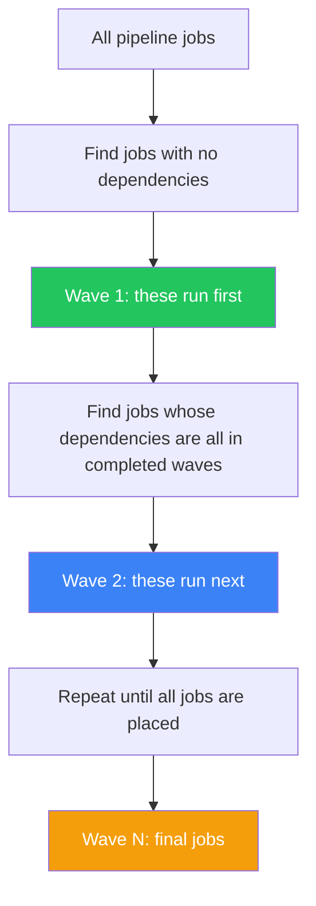

## Overview

The Pipeline Execution Simulator computes the actual execution order of your pipeline and animates it wave-by-wave, showing which jobs run in parallel and which must wait.

## Accessing the Simulator

Click the **Simulate** button in the center toolbar pill. A floating panel appears in the bottom-right corner.

## Step-by-Step Usage

<Steps>
  <Step title="Build your pipeline">
    Add jobs, set stages, and create `needs` dependencies
  </Step>
  <Step title="Click 'Simulate'">
    The Simulator panel opens in the bottom-right corner, showing the computed wave breakdown
  </Step>
  <Step title="Review waves">
    Each wave lists which jobs run together in parallel. Jobs appear in the same wave only if their dependencies are all in earlier waves.
  </Step>
  <Step title="Click 'Run'">
    The animation begins — jobs on the canvas glow green as each wave executes
  </Step>
  <Step title="Watch the progression">
    - Current wave: spinner icon
    - Completed wave: ✓ checkmark
    - Active nodes: green glow effect
  </Step>
  <Step title="Review the summary">
    Footer shows totals: `3 waves · 6 jobs`
  </Step>
</Steps>

## How Waves Are Computed

### Example

```mermaid
gantt
    title Execution Timeline
    dateFormat X
    axisFormat %s

    section Wave 1
    build_app      :a, 0, 3
    build_docker   :b, 0, 4

    section Wave 2
    test_unit      :c, 4, 7
    test_e2e       :d, 4, 8

    section Wave 3
    deploy_staging :e, 8, 10

    section Wave 4
    deploy_production :f, 10, 12
```

## Visual Indicators

| Indicator | Meaning |
|-----------|---------|
| 🟢 Green glow on node | Job is currently executing in the active wave |
| ✓ Checkmark on wave | Wave completed successfully |
| Spinner on wave | Wave currently running |
| Footer count | Summary: `3 waves · 6 jobs` |

## What It Tells You

- **Too many sequential waves?** Your pipeline might be slower than necessary — add `needs` to enable more parallelism
- **All jobs in one wave?** You might be missing proper stage assignments
- **Unexpected ordering?** Check your `needs` dependencies for unintended chains

<Tip>
  The simulator helps you understand the actual parallelism of your pipeline before pushing it to GitLab — saving you from unexpected sequential bottlenecks and wasted CI/CD minutes.
</Tip>
