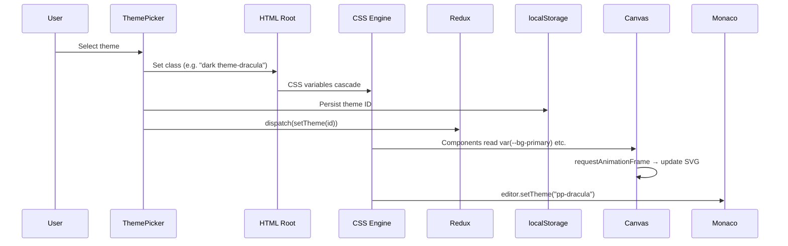
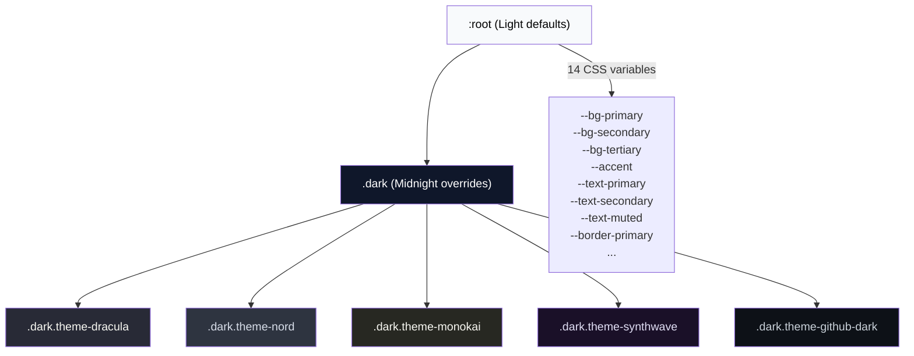

## Overview

PipelinePilot includes a professional theme engine with **7 built-in themes** that instantly transform the entire UI — canvas, toolbar, modals, and the Monaco YAML editor.

<CardGroup cols={3}>
  <Card title="Light" icon="sun">
    Clean white canvas with indigo accents — ideal for bright environments
  </Card>
  <Card title="Midnight" icon="moon">
    Deep navy blue — the default dark mode with indigo highlights
  </Card>
  <Card title="Dracula" icon="ghost">
    Purple-gray palette with cyan and pink syntax — the classic developer theme
  </Card>
  <Card title="Nord" icon="snowflake">
    Arctic blue-gray inspired by the Nord color palette
  </Card>
  <Card title="Monokai" icon="palette">
    Warm olive-dark with green and pink — Sublime Text inspired
  </Card>
  <Card title="Synthwave" icon="bolt">
    Deep purple with neon cyan and pink — retro cyberpunk aesthetic
  </Card>
  <Card title="GitHub Dark" icon="github">
    Matches GitHub's dark mode with blue accents
  </Card>
</CardGroup>

---

## How to Switch Themes

1. Click the **theme picker** — the gradient dot with chevron (▾) at the far right of the toolbar
2. Select any of the 7 themes from the dropdown
3. The entire UI updates **instantly** — no page reload needed

<Note>
  Your theme preference is saved to `localStorage` and persists across page reloads and browser sessions.
</Note>

---

## What Adapts

Every part of the UI responds to theme changes:

| Component | Adaptation |
|-----------|-----------|
| **Canvas Background** | Matches theme primary color via CSS variables |
| **Toolbar** | Glass background adapts to theme palette |
| **Job Nodes** | Card backgrounds, borders, and text colors |
| **YAML Editor** | Custom Monaco theme with matching syntax highlighting |
| **Stage Labels** | Text color matches theme muted palette |
| **Modals** | Stage Manager, Include Manager, Diff View — all themed |
| **Welcome Overlay** | Background cards and text adapt on first load |
| **Minimap** | React Flow minimap border and background |

### Monaco Editor Themes

Each app theme has a **dedicated Monaco editor theme** registered via `defineTheme()`:

| Theme | Editor Background | Key Color | String Color | Keyword Color |
|-------|------------------|-----------|-------------|--------------|
| **Midnight** | `#0c1222` | Indigo | Cyan | Indigo Bold |
| **Dracula** | `#282a36` | Cyan | Yellow | Pink Bold |
| **Nord** | `#2e3440` | Blue | Green | Dark Blue Bold |
| **Monokai** | `#272822` | Cyan | Yellow | Pink Bold |
| **Synthwave** | `#1a1028` | Cyan | Orange | Yellow Bold |
| **GitHub Dark** | `#0d1117` | Blue | Light Blue | Red Bold |
| **Light** | `#ffffff` | Indigo | Green | Purple Bold |

---

## Architecture

### Theme Application Flow

### CSS Variable Cascade

### Key Files

| File | Purpose |
|------|---------|
| `src/components/ThemePicker.tsx` | Theme definitions, picker UI, and `applyTheme()` utility |
| `src/index.css` | CSS variable declarations per theme class |
| `src/store/uiSlice.ts` | Redux state and persistence logic |
| `src/components/Canvas.tsx` | `requestAnimationFrame`-based SVG background reactivity |
| `src/components/MonacoPreview.tsx` | Custom Monaco theme registration and switching |

<Warning>
  React Flow's `<Background>` component uses SVG `<pattern>` elements that do not natively read CSS variables. PipelinePilot solves this with a `useEffect` + `requestAnimationFrame` approach to read computed styles after CSS classes are painted and push values to the SVG.
</Warning>
