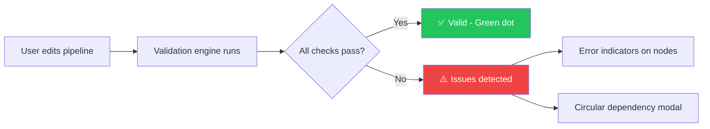
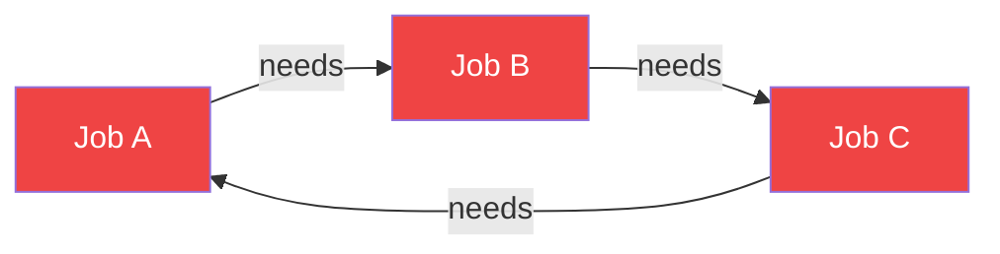

## Overview

PipelinePilot validates your pipeline in real time as you edit. The validation status indicator in the toolbar shows the current state with a colored dot.

## How Validation Works

## Validation Checks

| Check | Description | Severity |
|-------|-------------|----------|
| **Stage existence** | Every job must reference a stage that exists in the stages list | Error |
| **Circular dependencies** | Detects cycles in `needs` dependency chains | Error (blocks export) |
| **Missing dependencies** | `needs` references a job that doesn't exist | Warning |
| **Empty scripts** | Jobs should have at least one script command | Warning |
| **Duplicate names** | Job names must be unique across the pipeline | Error |

## Status Indicators

| Status | Toolbar Display | Meaning |
|--------|----------------|---------|
| **Idle** | Gray dot + "Idle" | No validation running, pipeline is clean |
| **Offline** | Red dot + "Offline" | GitLab API is unreachable (editing still works fully) |
| **Valid** | Green dot + "Valid" | All validation checks passed |

## Circular Dependency Detection

When a circular dependency is detected (e.g., `A needs B`, `B needs C`, `C needs A`):

<Steps>
  <Step title="Detection">
    The engine detects the cycle during dependency analysis
  </Step>
  <Step title="Modal appears">
    A **CircularDependencyModal** shows the full chain: `A → B → C → A`
  </Step>
  <Step title="Resolution">
    Remove one of the `needs` edges to break the cycle
  </Step>
  <Step title="Export unblocked">
    Once resolved, export and push are re-enabled
  </Step>
</Steps>

<Warning>
  Circular dependencies make pipelines unrunnable on GitLab. PipelinePilot blocks export when cycles are detected to prevent pushing broken pipelines.
</Warning>
